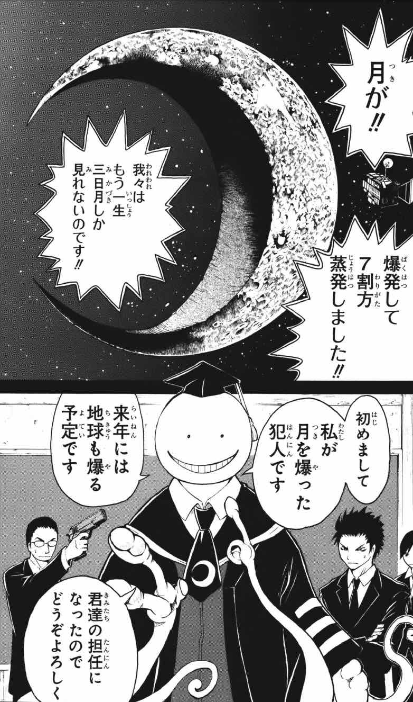
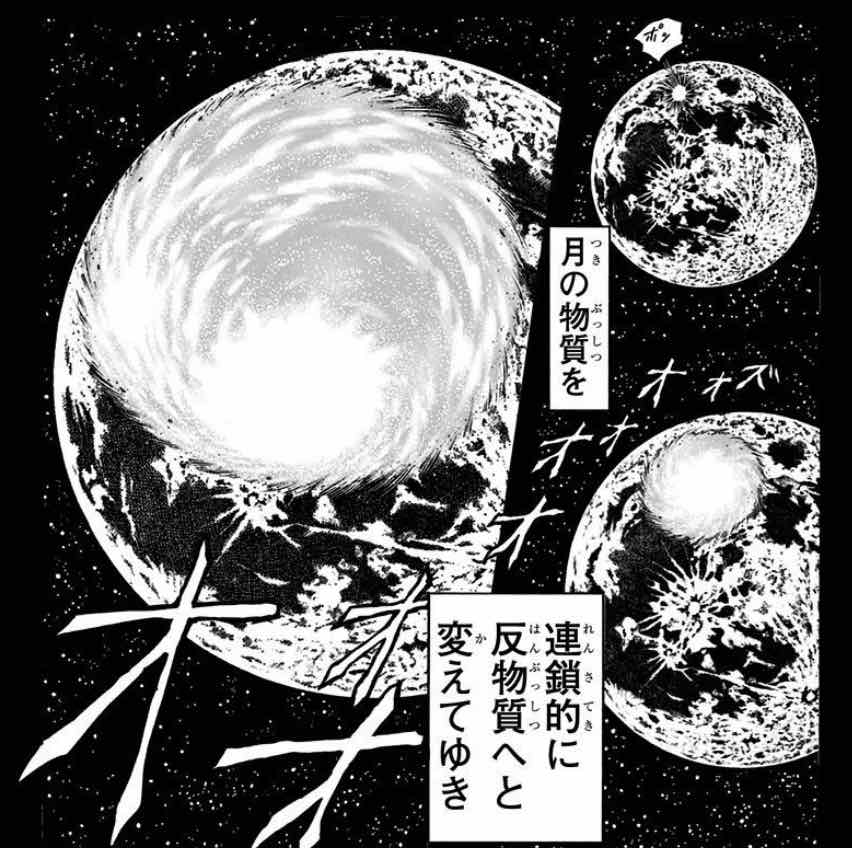
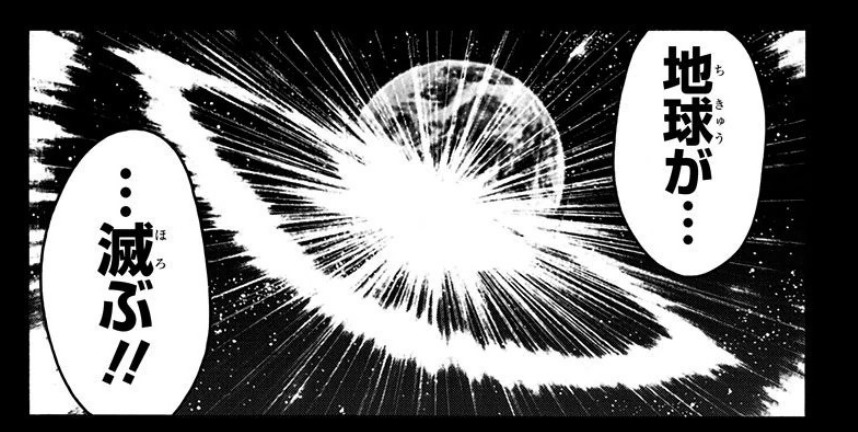

# 注意の時間

この記事にはネタバレが少しだけ含まれます。重大なものではないと思いますが、気になる人は先に原作を読んでください。\
この記事には計算ミスがあるかもしれません。重大なものではないと思いますが、気になる人は自分で検算してください。

# まえがきの時間
あなたは「暗殺教室」という漫画を知っているだろうか。

週刊少年ジャンプで少し前に連載されていた漫画で、椚ヶ丘中学校3年E組に突如**超破壊生物**が**担任教師**として現れるところから物語が始まる。いきなり読者がおいてけぼりである**（褒め言葉）**。

超破壊生物の名は伊達ではなく、この人（？）なんと本編開始の少し前に**月を7割蒸発させて三日月にしている**。

しかし、そんな彼はなかなかどうして教師としては優秀であり、生徒に慕われるようになっていく。\
**最高速度マッハ20**の怪物教師・通称**殺せんせー**を中心に展開されるシュールなギャグが魅力の漫画である。

こんな漫画を真面目に考察するのも野暮だが、月の7割を消すとは尋常ではないので、一体どれほどすごいことなのか考察してみたい。

# シミュレーションの時間

月の「直径の7割」が蒸発したと述べられていること、またその他複数の描写から**円筒状にくり抜くように蒸発した**と考えられる。

図にするとこのような感じだろうか。（この図はグリグリ動かせます）

まずこの部分の体積を求めたいが、手計算することは自分の数学力では無理なので、コンピュータの力に頼ることにする。\
具体的には、大量に乱数を発生させ、そのうち上の領域内に入ったものの数を数えることで体積を求める。これをMonte Carlo法という[^needles]。\

1000万回ほど試行すればおおむね安定した値を得ることができ、消滅した部分が月全体の**58.4%**[^smaller_than_expected]とわかる。
月の質量は地球のおよそ81分の1の7350京トン[^moon_weight]であるので、その58.4%は**4290京トン**[^density]だ。

[^needles]:余談ですが、人力でMonte Carlo法を行って円周率を推定することもできます。cf.[ビュフォンの針](https://ja.wikipedia.org/wiki/%E3%83%93%E3%83%A5%E3%83%95%E3%82%A9%E3%83%B3%E3%81%AE%E9%87%9D#%E3%83%A9%E3%82%B6%E3%83%AA%E3%83%8B%E3%81%AE%E5%AE%9F%E9%A8%93)
[^smaller_than_expected]:直径の7割がなくなった割にそこまで失われてないですね。図を見ると妥当な気もします。
[^moon_weight]:[Wikipedia:月](https://ja.wikipedia.org/wiki/%E6%9C%88%E8%B3%AA%E9%87%8F)
[^density]:月の岩石の密度が一様であることを仮定した。非常にざっくりだがいずれにせよ後述の大惨事は避けられないだろう

よし、じゃあ続けてこれをこれだけの岩石を蒸発させるだけのエネルギーを計算していこう……

と思っていたら、物語終盤で僕を**驚くべき真実**が待っていた。

# 真実の時間

実は月は殺せんせーによって爆破されたのではなく[^not_enough_speed]、**反物質生成実験の失敗により消滅していたのだった**。

[^not_enough_speed]:そもそも、よく考えれば殺せんせーはおそらく独力では月に行くことすらできない。彼の最高速度はマッハ20だが、[地球を離れるためにはマッハ33が必要](https://ja.wikipedia.org/wiki/%E5%AE%87%E5%AE%99%E9%80%9F%E5%BA%A6#%E7%AC%AC%E4%BA%8C%E5%AE%87%E5%AE%99%E9%80%9F%E5%BA%A6%EF%BC%88%E5%9C%B0%E7%90%83%E8%84%B1%E5%87%BA%E9%80%9F%E5%BA%A6%EF%BC%89)だからである。高高度まで行くことはできても、空気のない宇宙でさらに加速するには自らの肉体をかなりの量放出せねばならず危険が伴うだろう。体の一部を対消滅させる半物質ビームを推進剤にすれば効率的に加速できるだろうが、その技は本編開始時点では習得していない

これ以上詳しく書くとネタバレになってしまうのでここで止めておく。

反物質とはなにかを説明できるほどの学が自分にはないので、とりあえず月の58.4%は「蒸発したのではなく、この世のどこからも消え去った」ことにする。\

消えた分の質量は、有名な$E=mc^2$の式にしたがってエネルギーに変換される。\
$E$がエネルギー、$m$が質量であり、$c$は光速である。光速はとても大きな値なので、これは「質量は莫大なエネルギーに等価である」または「エネルギーはごく少ない質量に等価である」ということを表した式である。\

たとえば物が燃えるときなども質量は減少しているが、小さすぎて感知できない。広島型原爆ですら**反応したウランが900g足らず、実際に消失した量に至ってはたったの0.6g強**と推測されている[^little_boy]。

[^little_boy]:[Wikipedia:広島型原爆](https://ja.wikipedia.org/wiki/%E3%83%AA%E3%83%88%E3%83%AB%E3%83%9C%E3%83%BC%E3%82%A4)

おわかりいただけるだろうか。原爆で0.6gだったのが、今回消滅した量は**4290京トン**である。桁が違うどころの話ではない。

# 計算の時間

## エネルギー量
発生するエネルギー量を実際に計算すると、

$$
E=mc^2=4.29\times 10^9\times (299792458)^2=3.856\times 10^{36} \mathrm{J}
$$

わかりやすく言い換えると、これは次のようになる。

* 広島型原爆 600垓発分[^little_boy]
* 人類史上最大の核爆弾ツァーリ・ボンバ 1900京発分[^tsar]
* 確認されているなかで史上最大の隕石の衝突 10兆回分[^Vredefort]
* 太陽から放射される光エネルギーの総量 317年分[^sol]

[^tsar]:[Wikipedia:ツァーリ・ボンバ](https://ja.wikipedia.org/wiki/%E3%83%84%E3%82%A1%E3%83%BC%E3%83%AA%E3%83%BB%E3%83%9C%E3%83%B3%E3%83%90)
[^Vredefort]:[Wikipedia:フレデフォート・ドーム](https://ja.wikipedia.org/wiki/%E3%83%95%E3%83%AC%E3%83%87%E3%83%95%E3%82%A9%E3%83%BC%E3%83%88%E3%83%BB%E3%83%89%E3%83%BC%E3%83%A0)
[^sol]:[Wikipedia:太陽](https://ja.wikipedia.org/wiki/%E5%A4%AA%E9%99%BD)

**わかりやすくなってない。**

## 地球に到達するエネルギー量

これだけの規模の爆発が起こったら地球にも凄まじい影響が出るのではなかろうか[^moon_evaporates]。
[^moon_evaporates]:そもそも月の残りがどう考えても蒸発するがそれはそれ。

簡単のため、エネルギーのすべてが光で伝わるとする[^justification]。また、爆発のエネルギーは全方向に均等に放たれるものとしよう。
[^justification]:宇宙はほぼ真空なので、それほどまずい仮定ではないと思う。

地球の半径は6400km,地球と月の距離は384400kmなので、地球に到達するエネルギーは総エネルギー量の
$$
\frac{6400^2\pi}{4\pi \times 384400^2} = 0.00692... \%
$$
になる。
たったの0.007%！

なので、実際地球に到達するエネルギーは
$$
3.856\times 10^{36} \mathrm{J} \rightarrow 2.672\times 10^{32} \mathrm{J}
$$
程度にまで抑えられる。

少なくなったように見えるが、これでもまだ**太陽から地球が受けるエネルギー2.19年分**だ。仮に甘く見積もって月の消滅が丸1日かけて起こったとして、**月から降り注ぐ光の強さは通常の太陽光の961億倍**[^solar_power]。これが丸1日かけて地球上にまんべんなく降り注ぐわけで、おそらく植生が壊滅するだけならまだマシな方、地表は灼熱地獄と化し人類は死に絶えるだろう。
**焼け石に水とはまさにこのことである。**

[^solar_power]:太陽光の強度を[Wikipedia](https://ja.wikipedia.org/wiki/%E5%A4%AA%E9%99%BD%E3%82%A8%E3%83%8D%E3%83%AB%E3%82%AE%E3%83%BC#/media/File:Solar_land_area.png)を参考に平均$250\mathrm{W/m^2}$とした

# あとがきの時間

割と昔から空想科学読本みたいなのを書くのが夢で、ちょうどいい題材があったので書いてみました。楽しんでいただけたなら幸いです。\
こういうこと考えてると割と簡単に人類滅亡しちゃうので人類にはもっと頑張って欲しいですね（？）。

以上です
