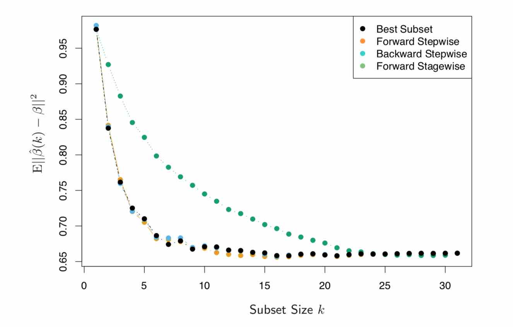

# はじめに、及びこの記事の使い方
[Elements of Statistical Learning 第2版](https://web.stanford.edu/~hastie/Papers/ESLII.pdf)の2章を読んだので、備忘録がてら。\

僕がそうなのですが、 *何が言いたいのかを先にわかりやすく書いていてくれればなあ、* と思うことが多いので、そういう人に役立つための記事を目指しました。\
初学者の人はこの記事に先に目を通すと理解しやすいかもしれませんしそうでないかもしれません。\
なお、この記事の想定読者は重回帰がなにかわかっているくらいのレベルです。重回帰の概念自体は簡単なので、2章の前半を読むかそのへんのネット記事を読んでください。\


# 記法
線形回帰は

$$
\begin{aligned} Y = \mathrm { E } ( Y | X \_ { 1 } , \ldots , X \_ { p } ) + \varepsilon = \beta \_ { 0 } + \sum \_ { j = 1 } ^ { p } X \_ { j } \beta \_ { j } + \varepsilon \end{aligned}
$$

と書き、残差を

$$
 r  =  y  - \mathbf { X } \hat { \beta }
$$

とする。

なお、行列のみ太字になっているかと思えば教科書ではそうでない箇所もある。よくわからない。データだとベクトルでも太字になるということかも。

また、本文中の前立腺がんの検診データをSklearnを用いて学習するコードを付しておく[^not exist]。
[^not exist]: Sklearnによる実装がなかったものはなし。おもにSubset Selectionが相当するが、これには本文中に擬似コードがついているのでわかると思う。
特徴量9次元、データ数97のこぢんまりとしたデータセットだ。

下準備:
```python
import numpy as np
import pandas as pd
from sklearn.model_selection import train_test_split
url = 'https://web.stanford.edu/~hastie/ElemStatLearn/datasets/prostate.data'
df = pd.read_csv(url, sep='\t', header=0)
X=df.drop(['Unnamed: 0','train'],axis=1)
Y=df.train
X_train,X_test,Y_train,Y_test=train_test_split(X,Y,test_size=30)
X_train,X_val,Y_train,Y_val=train_test_split(X_train,Y_train,test_size=0.1)
```

# 課題
さて、2章を通じて目標とされているのが、**データ同士の相関が大きいときに相関を減らし、予測値のデータへの過適合を避ける**ということだ。\
そのために、2つの手段が大きく分けて取られており、

* $\beta$を制約する
* データ$X$を制約する

である。2章の目玉はだいたいこれ。\
3.3,3.4は前者を、3.5は後者を考察している。

# $\beta$の制約
## Subset Selection
$\beta$からうまく一部を選ぶ、言い換えれば残りの$\beta$を0にする。この時、$X$のうち相関が大きいものがいなくなるように$\beta$を選択していれば相関は減る。
### Best-Subset Selection
とれる$\beta$の個数に対し一番Lossの少ないもの。特徴量の数$p$が多いとき($p>40$くらい)探し出すのは現実的ではない。要するに理論値。\
### Forward-Stepwise Selection, Backward-Stepwise Selection
$\beta_0$のみの状態から最もLossを減少させるような$\beta$を選び、それを加えて回帰。この際以前に加えた$\beta$も修正する。Backward-Stepwise Selectionは、逆にすべて加えている状態から削っていく。
### Forward-Stagewise Selection
Forward-Stepwise Selectionと大体一緒だが、新たな$\beta$を加えても以前の$\beta$を修正しないという制約付き。これを修正した方法であるIncremental Forward Stagewise Regression(3.8.1)は高次元において強力。
#### Incremental Forward Stagewise Regression
全ての$\beta$が0のところから初めて、「もし動かしたならば、最もLossを減少させる$\beta$」を少しだけいじることを繰り返す。

## Shrinkage

$$
\begin{aligned} \operatorname { RSS } ( \beta ) & = \sum \_ { i = 1 } ^ { N } \left( y \_ { i } - f \left( x \_ { i } \right) \right) ^ { 2 } 
= \sum \_ { i = 1 } ^ { N } \left( y \_ { i } - \beta \_ { 0 } - \sum \_ { j = 1 } ^ { p } x \_ { i j } \beta \_ { j } \right) ^ { 2 } \end{aligned}
$$

を最小化する、すなわち
$$
\hat { \beta } = \underset { \beta } { \operatorname { argmin } } \left\( \sum _ { i = 1 } ^ { N } \left( y _ { i } - \beta _ { 0 } - \sum _ { j = 1 } ^ { p } x _ { i j } \beta _ { j } \right) ^ { 2 } \right\)
$$

を求めるのが線形回帰であるが、ここに少し修正を加え、$\beta$の値に *ある種の傾向* をつけてやろうというもの。
### Ridge Regression

$$
\hat { \beta } ^ { \text { ridge } } = \underset { \beta } { \operatorname { argmin } } \left\( \sum _ { i = 1 } ^ { N } \left( y _ { i } - \beta _ { 0 } - \sum _ { j = 1 } ^ { p } x _ { i j } \beta _ { j } \right) ^ { 2 } + \lambda \sum _ { j = 1 } ^ { p } \beta _ { j } ^ { 2 } \right\)
$$
を求める。
$$
\begin{array} { c } { \hat { \beta } ^ { \text { ridge } } = \underset { \beta } { \operatorname { argmin } } \sum _ { i = 1 } ^ { N } \left( y _ { i } - \beta _ { 0 } - \sum _ { j = 1 } ^ { p } x _ { i j } \beta _ { j } \right) ^ { 2 } } \\ { \text { subject to } \sum _ { j = 1 } ^ { p } \beta _ { j } ^ { 2 } \leq t } \end{array}
$$
に同じ[^lagrange]。
[^lagrange]: ラグランジュの未定乗数法的なあれより

$\beta$の絶対値が小さくなる方向に働く。特に、線形性の仮定のもとで$y$に強く影響を及ぼしている特徴量$x$に対応する$\beta$はあまり小さくしない。

式で見てみよう。SVDにより
$$
\mathbf { X } = \mathbf { U D V } ^ { T }
$$
より、線形回帰で求めた$\hat{y}$が
$$
\hat { y } = \mathbf { X } \hat { \beta } = \mathbf { X } \left( \mathbf { X } ^ { T } \mathbf { X } \right) ^ { - 1 } \mathbf { X } ^ { T }  y  = \mathbf { U } \mathbf { U } ^ { T }  y = \sum _ { j = 1 } ^ { p }  u  _ { j }   u  _ { j } ^ { T }  y
$$
となるのに対し、Ridge回帰は
$$
\hat { y } = \mathbf { X } \hat { \beta } ^ { \text { ridge } } = \sum _ { j = 1 } ^ { p }  u  _ { j } \frac { d _ { j } ^ { 2 } } { d _ { j } ^ { 2 } + \lambda }  u  _ { j } ^ { T }  y 
$$

となり、特異値$d_j$の小さいものに対応する$\beta$ほど値を小さくされていることがわかる。特異値の解釈については、[前にSVDについて書いた記事](https://woodyzootopia.github.io/2018/12/%E5%83%95%E3%81%8C%E6%AC%A1%E3%81%AB%E9%81%8A%E3%81%B6%E3%81%B9%E3%81%8D%E3%82%B2%E3%83%BC%E3%83%A0%E3%82%92%E3%83%87%E3%83%BC%E3%82%BF%E3%81%8B%E3%82%89%E6%8E%A2%E3%81%9D%E3%81%86-%E7%B6%9A/)が参考になるかもしれない。


解は解析的に求まり、
$$
\hat { \beta } ^ { \text { ridge } } = \left( \mathbf { X } ^ { T } \mathbf { X } + \lambda \mathbf { I } \right) ^ { - 1 } \mathbf { X } ^ { T }  y 
$$

```python
from sklearn.linear_model import Ridge
clf=Ridge(alpha=0.5) #alpha corresponds to lambda
clf.fit(X_train,Y_train)
print('training   error:', np.mean((clf.predict(X_train)-np.array(Y_train))**2))
print('validation error:', np.mean((clf.predict(X_val)-np.array(Y_val))**2))
```

### Lasso
$$
\hat { \beta } ^ { \text { lasso } } = \underset { \beta } { \operatorname { argmin } } \left\( \frac { 1 } { 2 } \sum _ { i = 1 } ^ { N } \left( y _ { i } - \beta _ { 0 } - \sum _ { j = 1 } ^ { p } x _ { i j } \beta _ { j } \right) ^ { 2 } + \lambda \sum _ { j = 1 } ^ { p } \left| \beta _ { j } \right| \right\)
$$
を最小化する。

```python
from sklearn.linear_model import Lasso
clf=Lasso(alpha=1) #alpha corresponds to lambda
clf.fit(X_train,Y_train)
print('training   error:', np.mean((clf.predict(X_train)-np.array(Y_train))**2))
print('validation error:', np.mean((clf.predict(X_val)-np.array(Y_val))**2))
```

### 一般化
Ridge回帰、Lassoは損失関数に
$$
\sum _ { j = 1 } ^ { p } \left| \beta _ { j } \right| ^ q
$$
という**正則化項**を加えていると考えることができよう。Ridge回帰は$q=2$,Lassoは$q=1$だ。\
qを1や2以外にして一般化を考えたくなるが、

1. $q=1$であるLassoは正則化項の微分値が$\beta$に非依存であり、$\beta$をゼロにしようという力が働くので嬉しい。
  * なぜ嬉しいかというと、少ない変数で説明がされるようになるため。「これとそれと、あれとあれがちょっとずつ影響を及ぼしています」より「これとこれでほとんど決まっています(ｷﾘｯ」と説明されたほうがわかりやすく、そこから仮説などを引き出すことが容易。
  * 当然、$q$を1より大きくするとこの効果は失われてしまう。
2. $q<1$は非凸という性質を持つので解きづらい。

という問題が有るため、実際には難しい。\
なので、例えばRidge回帰とLassoの *間を取ろう* と思ったら
$$
\lambda \sum _ { j = 1 } ^ { p } \left( \alpha \beta _ { j } ^ { 2 } + ( 1 - \alpha ) \left| \beta _ { j } \right| \right)
$$
のように重み付き和で *間を取る* ことが多い。これを**Elastic Net**という。

```python
from sklearn.linear_model import ElasticNet
clf=ElasticNet(alpha=1.0, l1_ratio=0.5)
clf.fit(X_train,Y_train)
print('training   error:', np.mean((clf.predict(X_train)-np.array(Y_train))**2))
print('validation error:', np.mean((clf.predict(X_val)-np.array(Y_val))**2))
```

### Least Angle Regression
省略。

# Xの制約
## Principal Components Regression
$M$個の主成分$\mathbf{Z}\_m$($M<p$)で線形回帰する。特に、これら$z$はそれぞれ直行しているので、$y$とそれぞれの$z$について単回帰してやって求めた$\beta$は、全体で線形回帰したときの係数に一致する。SVDについては先ほども挙げたが[以前書いた記事](https://woodyzootopia.github.io/2018/12/%E5%83%95%E3%81%8C%E6%AC%A1%E3%81%AB%E9%81%8A%E3%81%B6%E3%81%B9%E3%81%8D%E3%82%B2%E3%83%BC%E3%83%A0%E3%82%92%E3%83%87%E3%83%BC%E3%82%BF%E3%81%8B%E3%82%89%E6%8E%A2%E3%81%9D%E3%81%86-%E7%B6%9A/)が参考になるかもしれない。
```python
from sklearn.decomposition import TruncatedSVD
from sklearn.linear_model import LinearRegression
svd=TruncatedSVD(n_components=5,random_state=42) #n_components corresponds to dimension
Z_train=svd.fit_transform(X_train)
Z_val=svd.transform(X_val)
clf=LinearRegression(normalize=True)
clf.fit(Z_train,Y_train)
print('training   error:', np.mean((clf.predict(Z_train)-np.array(Y_train))**2))
print('validation error:', np.mean((clf.predict(Z_val)-np.array(Y_val))**2))
```
単回帰によって求められる係数$\hat{\theta}$は
$$
\hat { \theta } _ { m } = \frac {\left\langle  z  _ { m } ,  y  \right\rangle}  {\left\langle  z  _ { m } ,  z  _ { m } \right\rangle}
$$
でかけるので、これが重回帰のそれと一致していることは次のコードで確かめられる:
```python
theta = [np.dot(Y_train,Z_train[:,m]) / np.dot(Z_train[:,m],Z_train[:,m]) for m in range (clf.coef_.shape[0])]
theta = [round(item,9) for item in theta]
print(clf.coef_)
print(theta)
```
```text
[0.00931832 -0.00541911 -0.01925209  0.01461905 -0.03733386]
[0.00943872, -0.00549022, -0.0190839, 0.01476765, -0.03680412]
```
## Partial Least Squares
省略。

終わり
