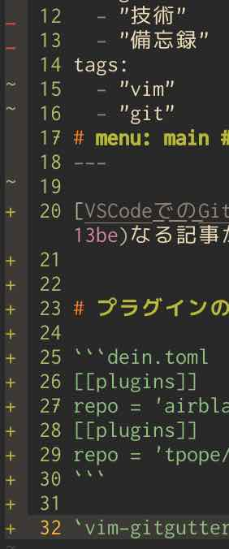

Qiitaに[VSCodeでのGitの基本操作まとめ](https://qiita.com/y-tsutsu/items/2ba96b16b220fb5913be)なる記事が上がっていたので対抗してVimで快適にGitを編集する設定を書きます


# プラグインのインストール

```dein.toml
[[plugins]]
repo = 'airblade/vim-gitgutter'
[[plugins]]
repo = 'tpope/vim-fugitive'
```

`vim-gitgutter`は変更があった行を左端に表示してくれます。

実はこれ以外にも便利機能があるのでそれも紹介します。

更新が反映されるまでの時間を短くしたいのでそれも設定しておきましょう。下の設定だと100msになります。
```init.vim
set updatetime=100
```

`vim-fugitive`はGitコマンドをVim内でも使えるようにしてくれる便利なやつです。これも今から解説していきます。

# プラグインの解説
## vim-gitgutter

`vim-gitgutter`は行ごとの変更内容を表示してくれるプラグインですが、**hunk**と呼ばれる「変更のカタマリ」ごとに変更を管理することもできます[^what is hunk]。

（事前[^what is jizen]に設定していない場合は）次のようなマッピングが自動でつけられます。

[^what is hunk]:行単位で評価される。`git add --patch`のそれに近い
[^what is jizen]:プラグインを読み込む前

```init.vim
nmap <Leader>hs <Plug>GitGutterStageHunk
nmap <Leader>hu <Plug>GitGutterUndoHunk
nmap <Leader>hp <Plug>GitGutterPreviewHunk
nmap ]c         <Plug>GitGutterNextHunk
nmap [c         <Plug>GitGutterPrevHunk
omap ic         <Plug>GitGutterTextObjectInnerPending
omap ac         <Plug>GitGutterTextObjectOuterPending
xmap ic         <Plug>GitGutterTextObjectInnerVisual
xmap ac         <Plug>GitGutterTextObjectOuterVisual
```

###  hunkの管理（上3行で設定されている）
`GitGutterStageHunk`, `GitGutterUndoHunk`, `GitGutterPreviewHunk`はそれぞれ、変更のカタマリをstage、undo、（変更前の状態と）比較するコマンドです。

自分の`<Leader>`キーの位置が不便な人は各自
```init.vim
nmap （あなたのやりたいマッピング） <Plug>GitGutterStageHunk
```
のように設定してもいいでしょう。

もしくは`<Leader>`キー自体を事前[^what is jizen]に変更するのもアリですね。例えば自分は下のようにして`<Leader>`キーをスペースキーにしている
```init.vim
let mapleader = "\<Space>"
```
ので、上3つは`<Space>hs`などで発動します。

### hunk間の移動
残りはhunk間を移動したり選択したりするコマンドですね。

`]c`, `[c`でそれぞれ次の/前のhunkに移動します。

`ac`, `ic`でhunkを囲むテキストオブジェクトになります。`ac`の方は周りの空行も含みます。\
例えば、`vic`でhunk内を選択したり、`cac`でhunkとその周囲の空行を削除して編集したりできます。

## vim-fugitive

こちらは短いマッピングを自動でつけてくれたりはせず、`:Gwrite`みたいにコマンドが登録されるようになっています。\
でもいちいちコマンドを打ちたくはないので、いい感じに設定しましょう。自分の設定を参考までに貼っておきます。

```init.vim
nnoremap <leader>gs :tab sp<CR>:Gstatus<CR>:only<CR>
nnoremap <leader>ga :Gwrite<CR>
nnoremap <leader>gc :Gcommit<CR>
nnoremap <leader>gb :Gblame<CR>
nnoremap <leader>gl :Git log<CR>
nnoremap <leader>gh :tab sp<CR>:0Glog<CR> " abbrev for `git history`: create new quickfix tab for history
nnoremap <leader>gp :Gpush<CR>
nnoremap <leader>gf :Gfetch<CR>
nnoremap <leader>gd :Gvdiff<CR>
nnoremap <leader>gr :Grebase -i<CR>
nnoremap <leader>gg :Ggrep 
nnoremap <leader>gm :Gmerge 
```

（先程書いたように、自分の環境では`<Leader>`が`<Space>`に置き換えられているためこのような書き方になっています。各自自分の好きなようにいじってください）

上から順に解説していきますね。


### `<leader>gs`
`git status`が新しいタブにフルスクリーンで出てきます[^what is gs doing]。この中では専用のキーマッピングが使えるようになっています（詳しくは`:h fugitive-mappings`を見てください）。
重要なものを解説すると、

| マッピング        | 効果                                                                                 |
| ----------------- | -----------------------------------------------------------------------------------  |
| s                 | ステージ(add)する                                                                    |
| u                 | ステージしたものを取り除く(undo)                                                     |
| =                 | diffを表示・非表示にする                                                             |
| dv                | 変化の見やすい、いい感じのdiffをHEADとの間で見る（すごく見やすいのでお試しあれ）     |
| X                 | 変更を取り消す                                                                       |

それが終わったらコミットしましょう。

| マッピング        | 効果                                                                                                               |
| ----------------- | ------------------------------------------------------------------------------------------------------------       |
| cc                | コミットする                                                                                                       |
| ca                | 直前のコミットを変更する形でコミットする(`git commit --amend`)                                                     |
| ce                | 直前のコミットを変更する形でコミットする<br>ただし、コミットメッセージを変更しない(`git commit --amend --no-edit`) |
| cw                | 直前のコミットのコミットメッセージのみを変更する                                                                   |
| cvc               | verboseモードでコミットする(`git commit -v`)                                                                       |
| cf                | fixup!でコミットする(`git commit --fixup=`)<br>これを実行して直後に`<Tab><Enter>`をおすとHEADにfixupする           |

[^what is gs doing]:普通に`:Gstatus`すると今のタブで起動してしまい狭いので、それを回避する。別に気にしないという人はこうしなくても良いです

### `<leader>ga`
このファイルを`git add`します。
### `<leader>gc`
`git commit`します。
### `<leader>gb`
`git blame`します。行ごとに最後にコミットされたのはいつなのか・誰なのか一覧できます。

### `<leader>gl`
`git log`します。でもこれだと見づらいので、自分は
```~/.gitconfig
[alias]
    logall = log --graph --pretty=format:'%Cred%h %Cgreen(%>(15,trunc)%cr, %ci) %C(bold blue)<%an>%Creset -%C(yellow)%d%Creset %s' --abbrev-commit --date=relative --all
```
```init.vim
nnoremap <leader>gl :Git logall<CR>
```
みたいな感じにして見やすくしてます。

### `<leader>gh`
別タブで今開いているファイルの変更履歴をたどれます。超便利。\
Quickfixを使うようになっています。location listを使いたい場合は
```init.vim
nnoremap <leader>gh :tab sp<CR>:0Gllog<CR>
```
にしたら良いです。マッピングは`git history`をイメージしました（実際にはそんなコマンドはありません）。

### `<leader>gp`
`git push`します。
### `<leader>gf`
`git fetch`します。~~そろそろ飽きてきました~~
### `<leader>gd`
変化の見やすい、いい感じのdiffをします。[`<leader>gs`](./#leader-gs)の`dv`と同じです
### `<leader>gr`
`git rebase -i`します。

### `<leader>gg`
`gitgrep`でgitリポジトリ全体から高速で検索をかけます。これも、location listを使いたい場合は
```init.vim
nnoremap <leader>gg :Glgrep 
```
としたらいいです。

### `<leader>gm`
`git merge`します。コンフリクトが発生したらそのまま修正作業に入れます。
# 結果
Vim + Git is 最強
