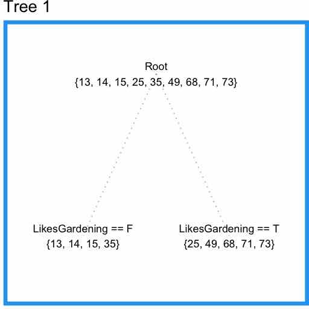
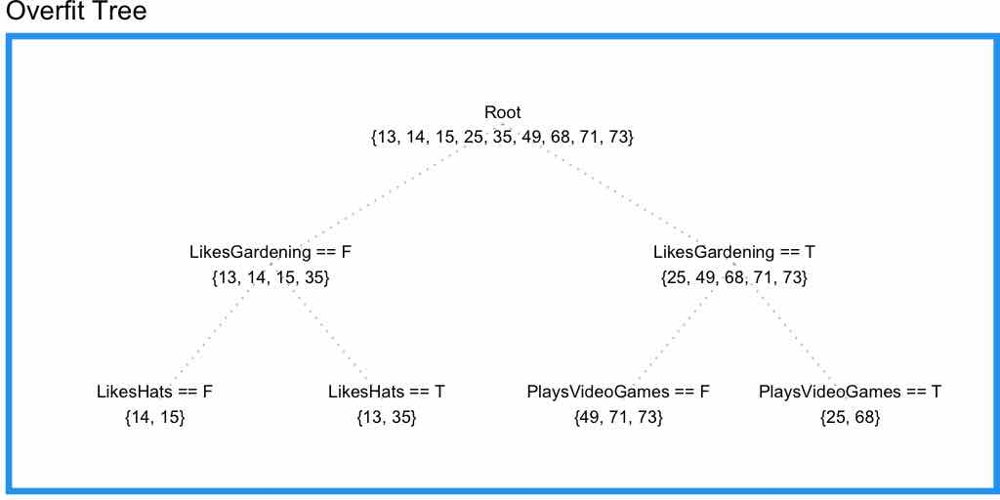
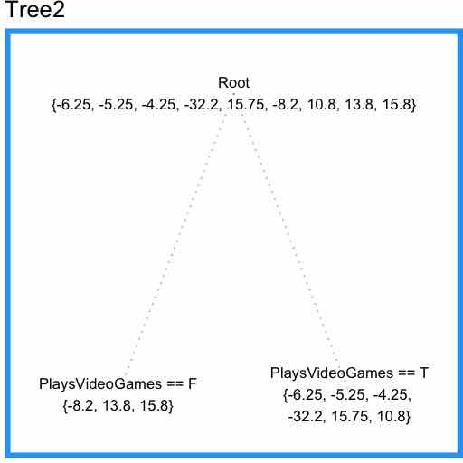
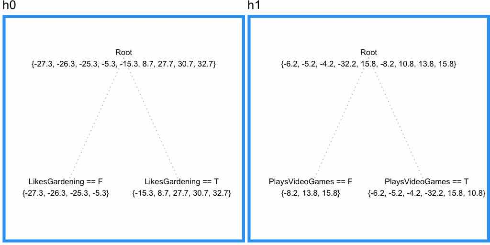
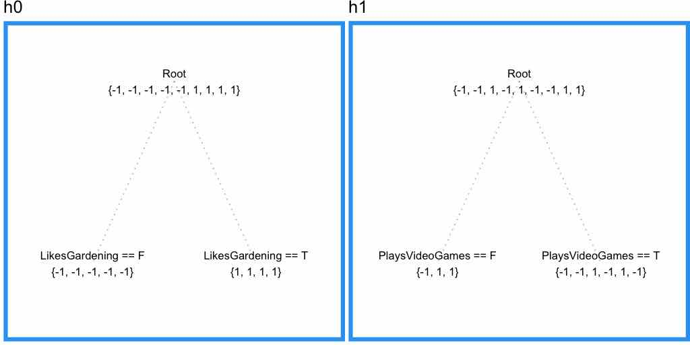

>この記事は、Kaggle Masterである[Ben Gorman](http://blog.kaggle.com/author/bengorman/)さんによる[Gradient Boosting Explained](https://gormanalysis.com/gradient-boosting-explained/)を和訳したものです。日本語でGradient Boostingの原理を解説した記事があまりなかったのですが、この記事が非常にわかりやすかったので、ご本人に和訳の許可をお願いしたところ、快諾していただきました。Benさん、ありがとうございます。この記事が日本人Kagglerの助けになれば幸いです。\
>また、この記事は[以前Qiitaに投稿したもの](https://qiita.com/woodyOutOfABase/items/232e982094cd3c80b3ee)を改稿したものです。

# まえがき
線形回帰がトヨタのカムリだとしたら、勾配ブースティングは **UH-60ブラックホークヘリコプター** でしょう。勾配ブースティングの実装の一つであるXGBoostはKaggleの機械学習コンペで長らく使われ、勝利に貢献し続けています。
しかし残念なことに、（以前の僕を含め）多くの人がこれをブラックボックスとして使ってしまっています。多くの実利的な記事でも説明が省かれています。ですので、この記事で原始的な勾配ブースティングの基礎を、直感的かつ包括的に身につけていきましょう。

# 動機
簡単な例を出します。ある人がビデオゲームが好きか、庭いじりが好きか、帽子が好きかという３つの情報からその人の年齢を予測するという問題を考えます。２乗誤差を最小化するのが目的です。９つの訓練データがあります。

| PersonID | Age | LikesGardening | PlaysVideoGames | LikesHats |
|----------|-----|----------------|-----------------|-----------|
| 1        | 13  | FALSE          | TRUE            | TRUE      |
| 2        | 14  | FALSE          | TRUE            | FALSE     |
| 3        | 15  | FALSE          | TRUE            | FALSE     |
| 4        | 25  | TRUE           | TRUE            | TRUE      |
| 5        | 35  | FALSE          | TRUE            | TRUE      |
| 6        | 49  | TRUE           | FALSE           | FALSE     |
| 7        | 68  | TRUE           | TRUE            | TRUE      |
| 8        | 71  | TRUE           | FALSE           | FALSE     |
| 9        | 73  | TRUE           | FALSE           | TRUE      |

直感的には、

- 庭いじりが好きな人は年寄りだろう
- ビデオゲームが好きな人は若いだろう
- 帽子が好きかはただのランダムノイズだろう

という気がするかもしれません。
これらの仮説が正しいかどうか、（雑ですが）簡単に見ることもできます：

| Feature         | FALSE            | TRUE                     |
|-----------------|------------------|--------------------------|
| LikesGardening  | {13, 14, 15, 35} | {25, 49, 68, 71, 73}     |
| PlaysVideoGames | {49, 71, 73}     | {13, 14, 15, 25, 35, 68} |
| LikesHats       | {14, 15, 49, 71} | {13, 25, 35, 68, 73}     |

では決定木を使ってこのデータをモデル化していきましょう。末端の枝が少なくとも３つのサンプルを持つように制約すると、LikesGardeningで次のように分割されます。

いいですね。しかしPlaysVideoGamesという重要な情報が考慮されていません。末端の枝が持つサンプルの最小数を２つに減らしてみましょう。

確かにPlaysVideoGamesから情報を取り出すことに成功したようですが、LikesHatsの情報も取り出してしまっています。これはすなわち、訓練データに過適合しており、木がノイズに惑わされていることを意味します。
これが単一の決定/回帰木を使うことの問題点です。 **複数の、重なり合った特徴空間の領域から予測力を身につけることができない**のです。

最初の木の訓練データ残差を計算します。

PersonID  | Age   | Tree1 予測         | Tree1 残差       |
--------- | ----- | ------------------ | ---------------- |
1         | 13    | 19.25              | -6.25            |
2         | 14    | 19.25              | -5.25            |
3         | 15    | 19.25              | -4.25            |
4         | 25    | 57.2               | -32.2            |
5         | 35    | 19.25              | 15.75            |
6         | 49    | 57.2               | -8.2             |
7         | 68    | 57.2               | 10.8             |
8         | 71    | 57.2               | 13.8             |
9         | 73    | 57.2               | 15.8             |

ここで、二つ目の回帰木を最初の木の**残差**にフィットさせることができます。

この木は **LikesHats特徴量を含んでいない** ことに注目してください。なぜなら、この木はすべてのサンプルを使ってLikesHatsとPlaysVideoGamesのどちらの特徴量を採用するか決めることができているのに対し、最初の木では入力空間の少ない領域だけで決めていたために、ランダムノイズによってLikesHatsを分割のための特徴量として選択してしまっていたからです。
このように、最初の木の予測に「誤差修正」の予測を足すことで予測をより良くできます。

|PersonID | Age | Tree1 予測 | Tree1 残差 | Tree2 予測 | 合計予測 | 最終残差 |
|---------|-----|------------------|----------------|------------------|---------------------|----------------|
|1        | 13  | 19.25            | -6.25          | -3.567           | 15.68               | 2.683          |
|2        | 14  | 19.25            | -5.25          | -3.567           | 15.68               | 1.683          |
|3        | 15  | 19.25            | -4.25          | -3.567           | 15.68               | 0.6833         |
|4        | 25  | 57.2             | -32.2          | -3.567           | 53.63               | 28.63          |
|5        | 35  | 19.25            | 15.75          | -3.567           | 15.68               | -19.32         |
|6        | 49  | 57.2             | -8.2           | 7.133            | 64.33               | 15.33          |
|7        | 68  | 57.2             | 10.8           | -3.567           | 53.63               | -14.37         |
|8        | 71  | 57.2             | 13.8           | 7.133            | 64.33               | -6.667         |
|9        | 73  | 57.2             | 15.8           | 7.133            | 64.33               | -8.667         |

| Tree1 二乗誤差総和 | 合計二乗誤差総和 |
|-----------|--------------|
| 1994      | 1765         |

# 勾配ブースティング　草案１
上のアイデアにをもとに、最初の（愚直な）勾配ブースティングを式で書いてみましょう。

1. モデルをデータにフィットさせる。

    $
    F\_1(x)=y
    $

2. 別のモデルを残差にフィットさせる。

    $
    h\_1(x)=y-F\_1(x)
    $

3. 新たなモデルを作る。

    $
    F\_2(x)=F\_1(x)+h\_1(x)
    $

この考え方を一般化するのは難しくないでしょう。一つ前のモデルの残差を修正するような新しいモデルを足していけばいいだけですから。

$
F(x)=F\_1(x)\longmapsto F\_2(x)=F\_1(x)+h\_1(x)\ldots\longmapsto F\_M(x)=F\_{M-1}(x)+h\_{M-1}(x)
$

(ここで、$F\_1(x)$はyにフィットさせた最初のモデルとする)

この作業の最初に$F\_1(x)$をフィットさせているので、各ステップでやるべきことは$h$をフィットさせること、すなわち$h\_m(x)=y-F\_m(x)$なる$h\_m$を見つけることです。

おや、ちょっと待ってください。ここで$h\_m$は単に「モデル」と言っているに過ぎず、**木構造を持っていなければならないという制約はありません**。これは勾配ブースティングのより一般的な概念であり、強みです。勾配ブースティングとは、 *あらゆる* 弱い学習機を繰り返し強化することができるという仕組みなのです。

ですので、理論的には、うまくプログラムが書かれていれば、勾配ブースティングモジュールに好きな弱い学習機クラスを「挿入」して使うことができます。実際には、$h\_m$はほぼ全て木の学習機なので、以下$h\_m$は今までの例と同じように回帰木と考えて差し支えありません。

# 勾配ブースティング　草案２
ではもう少しいじって多くの勾配ブースティングの実装に近づけていきましょう。具体的には、単一の予測値でモデルを初期化するようにします。\
たとえば我々の（今の）タスクは二乗和誤差の最小化なので、$F$は訓練データの平均値で初期化されます。

$
F\_0(x)=\underset{\gamma}{\arg\min} \sum^n\_{i=1} L(y\_i,\gamma )= \underset{\gamma}{\arg\min} \sum^n\_{i=1}(\gamma - y\_i)^2 = \frac{1}{n}\sum^n\_{i=1}y\_i
$

そこから後続の$F\_m$を再帰的に定めていけばいいです。

$
F\_{m+1}(x) = F\_m(x) + h\_m(x) = y, \mbox{for } m \ge 0
$

$ h\_m $は基本学習機のクラス$\mathcal{H}$から持ってきます（たとえば回帰木です）。
ここで、何がハイパーパラメータ$m$としてもっとも良い値なのかと気になっているかもしれません。言い換えるならば、何回だけモデル$F$の残差修正作業を行うのがいいのかと。回答としては、[クロスバリデーション](https://en.wikipedia.org/wiki/Cross-validation\_(statistics))で様々な$m$を試してみるのが一番でしょう。

# 勾配ブースティング　草案３
ここまで二乗誤差を最小化するモデルを立ててきましたが、誤差の *絶対値* を最小化したくなったらどうすればいいのでしょう？基本学習機（回帰木）を絶対値誤差を最小化するよう変更することもできますが、欠点がいくつかあります……

1. データのサイズによっては計算量が膨大になってしまう（分割を考えるたびに中央値を探さないといけないので）。

2. 任意のモデルを「挿入」できるという利点を失ってしまう。我々の使いたい目的関数をサポートしている弱い学習機しか「挿入」できなくなってしまう。

代わりに、もっとスマートなやり方をとります。例題に立ち戻りましょう。まずは$F\_0$を決定するために、絶対値誤差を最小化する値を選びます。これは$median(y)=35$です。これで残差$y-F\_0$が計算できます。

| PersonID  | Age   | $F_0$   | 残差       |
| --------- | ----- | ---- | ----------- |
| 1         | 13    | 35   | -22         |
| 2         | 14    | 35   | -21         |
| 3         | 15    | 35   | -20         |
| 4         | 25    | 35   | -10         |
| 5         | 35    | 35   | 0           |
| 6         | 49    | 35   | 14          |
| 7         | 68    | 35   | 33          |
| 8         | 71    | 35   | 36          |
| 9         | 73    | 35   | 38          |

1つ目と4つ目のサンプルを例にとります。$F\_0$の残差は-22と-10です。この残差を1減らすことができたとすると、二乗誤差はそれぞれ43と19減少する[^2]のに対し、絶対値誤差はどちらも1減少します。そのため、二乗誤差を最小化しようとする普通の回帰木は、1つ目のサンプルの残差をより強く減らそうとするでしょう。しかし、絶対値誤差最小化が問題の場合、これらを同じ量だけ減らすと、同じ量だけ損失関数が減少します。

このことを考えると、$h\_0$を$F\_0$の残差にフィットさせるのではなく、**損失関数$L(y,F\_0(x))$の傾き**にフィットさせるというアイデアが生まれます。つまり、$h\_0$を「予測値が本当の値にある量だけ近づいた時の、損失関数の減少量」に訓練させていくわけです。絶対値誤差の場合だと、$h\_m$はそれぞれ単純に$F\_m$の残差の符号にフィットすることになります（二乗誤差の時は残差の大きさにフィットしていました）。$h\_m$がサンプルを葉に分類した後で、平均勾配を計算し、何らかの係数$\gamma $を、次の予測値$F\_m+\gamma h\_m$が損失関数を最小化するように決めます（実際には、葉ごとに異なる係数が用いられます）。

[^2]: [訳者注]$(-22)^2-(-21)^2$ , $(-10)^2-(-9)^2$

# 勾配降下法
この考え方を[勾配降下](https://en.wikipedia.org/wiki/Gradient\_descent)[^1]の考え方を使って形式化していきましょう。僕たちの最小化したい微分可能な関数を考えます。たとえば、

$
L(x\_1, x\_2) = \frac{1}{2}(x\_1-15)^2 + \frac{1}{2}(x\_2-25)^2
$

ここでの目的は$L$を最小化する$(x\_1, x\_2)$を求めることです。これは15,25からの$x\_1$,$x\_2$の距離を求める関数と解釈できます（$\frac{1}{2}$は計算がきれいになるように入っています）。もちろん直接この関数を最小化してもいいですが、 **勾配降下法を使えば** （直接最小化できないような） **もっと複雑な損失関数でも最小化できます。**

（以下、疑似コードです）

**初期化:**
繰り返し回数$M=100$
初期点$s^0=(0,0)$
ステップサイズ$\gamma =0.1$

**for m = 1 to M:**
1. $L$の点$s^{(m-1)}$における勾配を計算する
2. 勾配が（負に）もっとも大きい向きにその$\gamma$倍だけ「移動」する。すなわち、$s^{m} = s^{(m-1)} - \gamma \nabla L(s^{(m-1)})$

（ここまで、擬似コードです）

もし$\gamma$が小さく$M$が十分大きければ、$s^M$は$L$の最小値になります。

この仕組みを改善しうる方法としては、

- 固定回繰り返すのではなく、次の繰り返しで改善があまり起きなかったときにやめるようにする。

- 「移動」を一定の大きさにせず、[線形探索](https://en.wikipedia.org/wiki/Line\_search)のような賢いステップサイズ選択を行う

などが考えられます。

*もしここで詰まったなら、[勾配降下法で検索](https://www.google.com/search?q=gradient%20descent&cad=h)([日本語はこちら](https://www.google.com/search?client=safari&rls=en&q=%E5%8B%BE%E9%85%8D%E9%99%8D%E4%B8%8B%E6%B3%95&ie=UTF-8&oe=UTF-8))しましょう。他にもたくさん説明しているサイトがあります。*

## 勾配降下法を活用する
というわけで勾配降下法を僕たちの勾配ブースティングモデルに適用してみましょう。最小化したい目的関数を$L$とします。開始点は$F\_0(x)$です。$m=1$回目で、$L$の$F\_0(x)$における傾きを計算します。そして、その成分に弱い学習機をフィットさせます。\
回帰木の場合は、葉ノードは似たような特徴を持つサンプルの **傾きの平均**を算出します。それぞれの葉について、その傾きの平均の方向に（ステップの大きさを線形探索しながら）移動します。この結果が$F\_1$です。これを$F\_M$まで繰り返します。

結局何をしたのか振り返ってみましょう。僕たちは今、勾配ブースティングアルゴリズムを修正して**あらゆる微分可能な損失関数に使えるようにした**のです（この部分の説明が多くの勾配ブースティング法の説明で省かれてしまっています）。思考を整理するために、もう一度勾配ブースティングモデルを形式的に書いてみましょう。

（以下、疑似コードです）

**モデルを定数で初期化:**
$F\_0(x) = \underset{\gamma}{\arg\min} \sum\_{i=1}^n L(y\_i, \gamma)$

**for m = 1 to M:**
*擬似* 残差を以下の通り計算

$
r\_{im} = -\left[\frac{\partial L(y\_i, F(x\_i))}{\partial F(x\_i)}\right]\_{F(x)=F\_{m-1}(x)} \quad \mbox{for } i=1,\ldots,n.
$

基本学習機$h\_m(x)$を擬似残差にフィットさせる

ステップ倍率$\gamma\_m$を計算する（木モデルの場合は、葉ごとに異なる$\gamma\_m$を計算する）

更新する$F\_m(x)=F\_{m-1}(x)+\gamma\_m h\_m(x)$

（ここまで、擬似コードです）

ここまで理解できているかどうか確かめたい人は、最初の例題にこの実装を適用した結果が以下のとおりなので確認してください。二乗誤差と絶対値誤差両方について書かれています。

*   二乗和誤差バージョン

| Age   | $F_0$      | $r_0$          | $h_0$       | $gamma_0$   | $F_1$      | $r_1$                | $h_1$       | $gamma_1$   | $F_2$      |
| ----- | ------- | ----------------- | -------- | -------- | ------- | ----------------- | -------- | -------- | ------- |
| 13    | 40.33   | -27.33            | -21.08   | 1        | 19.25   | -6.25             | -3.567   | 1        | 15.68   |
| 14    | 40.33   | -26.33            | -21.08   | 1        | 19.25   | -5.25             | -3.567   | 1        | 15.68   |
| 15    | 40.33   | -25.33            | -21.08   | 1        | 19.25   | -4.25             | -3.567   | 1        | 15.68   |
| 25    | 40.33   | -15.33            | 16.87    | 1        | 57.2    | -32.2             | -3.567   | 1        | 53.63   |
| 35    | 40.33   | -5.333            | -21.08   | 1        | 19.25   | 15.75             | -3.567   | 1        | 15.68   |
| 49    | 40.33   | 8.667             | 16.87    | 1        | 57.2    | -8.2              | 7.133    | 1        | 64.33   |
| 68    | 40.33   | 27.67             | 16.87    | 1        | 57.2    | 10.8              | -3.567   | 1        | 53.63   |
| 71    | 40.33   | 30.67             | 16.87    | 1        | 57.2    | 13.8              | 7.133    | 1        | 64.33   |
| 73    | 40.33   | 32.67             | 16.87    | 1        | 57.2    | 15.8              | 7.133    | 1        | 64.33   |

*   絶対値誤差バージョン[^grad]

| Age   | $F_0$      | $r_0$          | $h_0$       | $gamma_0$   | $F_1$      | $r_1$                | $h_1$       | $gamma_1$   | $F_2$      |
| ---- | ---- | ----------------- | ----- | -------- | ------ | ----------------- | --------- | -------- | ------- |
| 13   | 35   | -1                | -1    | 20.5     | 14.5   | -1                | -0.3333   | 0.75     | 14.25   |
| 14   | 35   | -1                | -1    | 20.5     | 14.5   | -1                | -0.3333   | 0.75     | 14.25   |
| 15   | 35   | -1                | -1    | 20.5     | 14.5   | 1                 | -0.3333   | 0.75     | 14.25   |
| 25   | 35   | -1                | 0.6   | 55       | 68     | -1                | -0.3333   | 0.75     | 67.75   |
| 35   | 35   | -1                | -1    | 20.5     | 14.5   | 1                 | -0.3333   | 0.75     | 14.25   |
| 49   | 35   | 1                 | 0.6   | 55       | 68     | -1                | 0.3333    | 9        | 71      |
| 68   | 35   | 1                 | 0.6   | 55       | 68     | -1                | -0.3333   | 0.75     | 67.75   |
| 71   | 35   | 1                 | 0.6   | 55       | 68     | 1                 | 0.3333    | 9        | 71      |
| 73   | 35   | 1                 | 0.6   | 55       | 68     | 1                 | 0.3333    | 9        | 71      |

[^grad]:傾きが$1$か$-1$になっているのが確認できますね。

# 勾配ブースティング　草案４
ここでは収縮(shrinkage)と呼ばれる概念を導入します。考え方は極めて単純で、「移動」するたびに$\gamma$に学習率と呼ばれる0と1の間の数をかける、という作業を加えます。言い換えれば、移動距離が一定の割合で *収縮* していくということです。

今のWikipediaの記事はどうして収縮が有効なのかについて説明しておらず、ただ実験的に有効なようだ、と述べるのみです。個人的な意見ですが、サンプルへの予測が *ゆっくりと* 実測値に収束するからでしょう。ゆっくり収束することにより、目標値に近付いたサンプルは次第に大きな葉に分類されるようになり（木のサイズが一定だからです）、自然な正則化が起きるわけです。

# 勾配ブースティング　草案５
最後です。行サンプリング・列サンプリングです。多くの勾配ブースティングプログラムは、ブースティング計算の前にデータの行や列から一部をサンプリングすることができるようになっています。このテクニックは多くの場合効果があります。\
なぜならこれによってより *多様な* 木の分割が行われるようになるため、全体としてモデルに与えられる情報量が増えるからです。どうしてなのか気になった人は、僕の[ランダムフォレストに関する記事](https://gormanalysis.com/random-forest-from-top-to-bottom/)を読んでください。この記事では同じランダムサンプリングテクニックについて解説しています。

ああ、やっと最終版が完成しました！

# 勾配ブースティングの実用性
勾配ブースティングは実際とんでもなく効果的です。おそらくもっとも人気の実装であろう[XGBoost](https://github.com/dmlc/xgboost)は、たくさんのKaggle入賞者たちのアルゴリズムに使われています。XGboostはたくさんのワザを使うことで普通の勾配ブースティングより速く、より正確になっている（特に二次勾配降下法が挙げられます）のでぜひ試してみてください（Tianqi Chenの[アルゴリズムに関する論文](https://www.kdd.org/kdd2016/papers/files/rfp0697-chenAemb.pdf)も呼んでください）。さらには、マイクロソフトからやってきた刺客[LightGBM](https://github.com/Microsoft/LightGBM)も大きな注目を集めています。

勾配ブースティングには他に何ができるのでしょうか？僕はこれを回帰モデルとして紹介しましたが、クラス分類問題やランキング問題にも非常に有効です。なにせ**最小化したい微分可能な損失関数があるならば、それだけで十分**なのですから。よく使われる損失関数としては、分類問題なら[クロスエントロピー](https://en.wikipedia.org/wiki/Cross\_entropy)、回帰問題なら[二乗誤差平均](https://en.wikipedia.org/wiki/Mean\_squared\_error)がありますね。

では、この記事の最後は僕と同じKaggler、[Mike Kim](https://www.kaggle.com/mikeskim)の言葉で締めさせてください。

>私の唯一の目標は昨日の自分を勾配ブースティングすることだ。そして、それを毎日不屈の精神で続けていくことだ。

[^1]: [訳者注]ディープラーニングのそれとほぼ同一なので、馴染みのある人も多いかもしれません。

