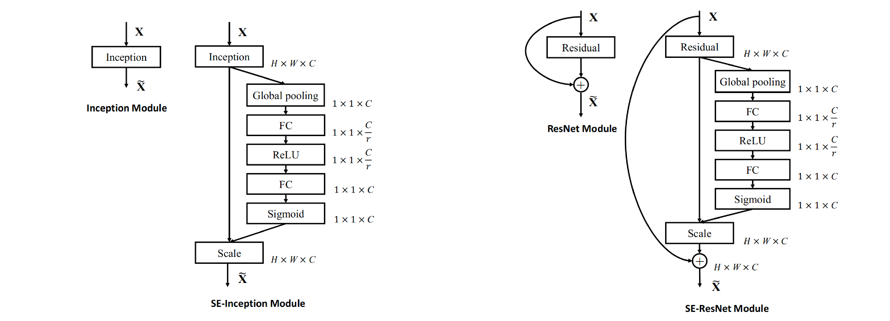

*この記事は未完成です。今残りを書いています*

# 論文の要旨

正式なタイトルは"Searching for MobileNetV3"。  
タイトル通り、かっこいい新手法の提案というよりは、**機械的な探索などを地道に貪欲に取り入れ、MobileNetV2の性能を向上させる方法を探した**というのが主な内容。  

（GPUではなく）モバイルデバイスのCPU上で速く走らせるために、細かく層の形とかを調整して**少しでもMulAddの数を減らそう**と試みる。  
この結果として、**MobileNetV3-Small, MobileNetV3-Large**という２つのモデルを提案している。

というわけで、４つに分けて改良ポイントを述べていく。自動アーキテクチャ探索、効率的な非線形関数、効率的なネットワークデザイン、効率的なセグメンテーションデコーダだ。

# 自動アーキテクチャ探索

MobileNetV3に使われた自動アーキテクチャ探索（いわゆるNAS, Neural Architecture Search)は主に２つのステップからなる。  

まず、[MnasNet論文](https://arxiv.org/abs/1807.11626)で提案された**platform-aware NAS**を使っておおまかにCNNの形を決定する。  
つぎに、**NetAdapt**を使って細かく性能を向上させていく。以上。

## platform-aware NASって何

アイデアは単純で、目的関数を定め、それを報酬として受け取る強化学習アルゴリズムを回す。  
具体的にはRNNを使って予測し、Proximal Policy OptimizationというアルゴリズムでRNNのパラメータを更新していくらしい（知らない）

* なお、強化学習を使ったのは便利で報酬がカスタマイズしやすかったため。他のアルゴリズム、たとえば遺伝的アルゴリズムを使っても良いかも by 論文
* 遅延時間計測には実際に**Google Pixelをつかった**。だから**platform-aware**

### 目的関数

モデル$m$が与えられた時、$ACC(m)$を最大化しつつ、実行（遅延）時間$LAT(m)$は小さくしたい。簡単に思いつくのは

$$
\underset{m}{\mathrm{maximize}}\ ACC(m)
$$
$$
\mathrm{subject\ to}\ LAT(m)\leq T
$$

だが、これだと一度の探索で一つの$T$に対するモデルしかできない。NASはコストがかかるので、一度の探索で複数のモデルを見つけたい。なのでこうする：

$$
\begin{eqnarray}
\underset{m}{\mathrm{maximize}}\   &R(m)\\\\\\
=\underset{m}{\mathrm{maximize}}\  &ACC(m)\times {\left[\frac{LAT(m)}{T}\right]}^m
\end{eqnarray}
$$
ただし、$w$は以下で定義される重み係数
$$
w = \begin{cases}
\alpha,\ \mathrm{if}\ LAT(m)\leq T\\\\\\
\beta,\ \mathrm{otherwise}
\end{cases}
$$
とする。

こうすると、"$T$をちょっとオーバーするけど$ACC$は高い"というモデルとかも提案されるようになる

本論文における違いとしては、$w=-0.07\rightarrow-0.15$に変更したこと。モデルが小さいときにはLATよりACCが劇的に変わるので、それに対応した  
また、Largeについては、MnasNet-A1と大体一緒だったので、これは省略してNetAdaptのみ行った

どのようにしてモデルを調整したかは、以下の図が詳しい：

また、パラメータは次の文章の通り：

**Squeeze-and-Excitationって何？？？？**

## Squeeze-and-Excitationって何

以前に[別の論文](https://arxiv.org/abs/1709.01507)で提案されていた手法。  
こちらも仕組みは単純。

なんらかのコンボリューションブロック$\mathbf{F}$が終わったら、その出力$\mathbf{U}$を  
1. Global average poolingする  
2. 全結合層にかける（1x1 convのようにチャンネルごとに混ぜ合わせる働きを持つことに注目）$$
s = \mathbf{F}_{ex}(z, \mathbf{W})=\sigma(\mathbf{W}_2\mathrm{ReLU}(\mathbf{W}_1z))
$$  
3. $s \in [0, 1]$を「倍率」として扱い、もとの特徴量にチャンネルごとに掛ける  
というもの。**これだけで性能が向上する**

これをSqueeze-and-Exciation Block略して**SE Block**という。

どのチャンネルがよく活性化しているか、という特徴を、チャンネルの重みとして活用しており、軽量な**self-attentionのようなもの**と捉えることができる。

ただ、闇雲に全部の層に突っ込みまくればいいというわけでもなさそうというのも指摘されていた：

中くらいの層では効果があるが、最初の方と最後の方の層ではクラス間にあまり差がない。とくに、最後の方の層は**チャネル数が多いのでSE Blockの計算量も大きくなってしまう**。  
最終層を取り除くと、ほぼ性能低下なし（<0.1%）でパラメータ増加を10%→4%に落とせる、うれしい！ということも指摘されていた

だが、どの層でSE Blockを使うかというのはハイパラとして細かく調整できそうだ。というわけで調整する[^hypara-okasikune]

[^hypara-okasikune]: $r$の定義がMnasNet論文とSEを提案した論文とで一致していないが、MnasNet論文における$r=0$とはおそらくSE Blockを使わないという意味だろう。

## NetAdaptって何

チャンネル数を細かく調整していくための方法。これも[別の論文](https://arxiv.org/abs/1804.03230)で提案されたもの。

1. 現在の設定を変更して、いくつかの「提案」をつくる。これらは、現在のモデルより$\delta$以上レイテンシが減っているようにすること。
	* 例えば、$\delta = 0.01\left|L\right|$とすれば、0.999倍以下になるようにできる。
	* レイテンシをいちいち測定するのは大変だが、設定によってほぼ確定するので設定ごとのルックアップテーブルを事前に作っておけば速い
	

2. 設定の変更に応じてL2ノルムの小さなフィルタを消す。
3. $T$ステップfine tuneして大体の性能を推定する。
4. 最も性能の高い「提案」が生き残る。

これを、ほしいレイテンシが得られるまで繰り返す。

この論文における変更点としては、  

* 性能の高い提案ではなく、性能・レイテンシの減少比$\frac{\mathrm{\Delta Acc}}{\left|\mathrm{\Delta Latency}\right|}$の高い提案が生き残る。
* 以下の設定を追加
	* expansion layerのサイズを減らす
	* ボトルネック層のボトルネックサイズを一括で調整
		* こうしないとresidual connectionがうまくいかなくなるので

# 効率的なネットワークデザイン

最初の方の層と、最終層が計算量的に重いことがわかったので、改善する。

## 復習

* 1x1 convの計算量は入力$C$チャンネル、出力$C'$チャンネルのとき$HWCC'$
* 3x3 depthwise convの計算量は$9HWC$（入力と出力は同じ$C$チャンネル）

## 最終層

これに則ってそれぞれのconvのMulAdd計算量を出すと、

* $7^2 \times 160 \times 960 \approx 7\mathrm{M}$
* $9 \times 7^2 \times 960 \approx 0.42\mathrm{M}$
* $7^2 \times 960 \times 320 \approx 15\mathrm{M}$←こいつと
* $7^2 \times 320 \times 1280 \approx 20\mathrm{M}$←こいつがやばい
* $1^2 \times 1280 \times 1000 \approx 1.3\mathrm{M}$

チャンネル数を最後に広げるのは、豊富な特徴量のために不可欠だが、計算が重いのでどうにかしたい。

こんなに計算量が重い理由の一つは、1x1 convを**7x7の解像度でやっているせいで計算量が約５０倍**になってしまっているためだろう。  
これを解決するため、最後の層をaverage poolingのあとに移す。これで機能を保ったまま解像度が1x1に下がる。

また、この手法をとったのなら、計算量を減らすために一つ前に入れられていたボトルネックも不要だ。これでさらに計算量を減らすことができ、最終的に下図のようになる。

実際、計算量は

* $7^2 \times 160 \times 960 \approx 7\mathrm{M}$
* $1^2 \times 960 \times 1280 \approx 1.2\mathrm{M}$
* $1^2 \times 1280 \times 1000 \approx 1.3\mathrm{M}$

になっており、合計計算量は$43.72 \mathrm{M} \rightarrow 9.5 \mathrm{M}$、約$30\mathrm{M}$の減少。これは7msに相当し、**全実行時間の11%**にもなる。  
この変更による精度の減少はほぼない。

## 最初の層

現行のモデルは、3x3コンボリューションフィルタ32個を使うことが多い。だが、これらは**お互いの鏡像である**ことがおおい。

そこで、フィルタを減らす代わりに**非線形関数を変えて**ムダを減らした  
最終的に他の非線形関数と同じような性能を出したhard swishを使うことにした。  

ReLUやswishで32フィルタを使ったときと同等の性能をh-swish&16フィルタで達成。$10\mathrm{M}$=1.2msの削減に成功した

# 非線形関数

既存研究で**swish**という非線形関数をReLUの代わりに使うことが提案されている。

$$
\mathrm{swish}\ x=x \cdot \sigma (x)
$$

だがsigmoidは重いのでどうにかしたい。というわけで**hard swish**という関数を使うことにする

$$
\text{h\-swish}\ \left[ x \right] = x \frac{\mathrm{ReLU6} (x+3)}{6}
$$

ただし、$\mathrm{ReLU6}(x) = \min (\mathrm{ReLU}(x), 6)$

これは、計算が軽いだけでなく、量子化されているときにsigmoidの近似により発生するかもしれない誤差が小さくなること、  
また実際には

$$
\mathrm{ReLU6}(x) = \begin{cases}
0\           &(x<0)\\\\\\
x(x+3)/6\    &(0<x<3)\\\\\\
x            &(3<x)
\end{cases}
$$

のように最適化でき、関数呼び出しは行われないので、メモリアクセスを減らしてレイテンシを劇的に下げることができる。嬉しい。  
ちなみにこれはすでにTFLiteに実装されており、デフォルトで使えるそう。

しかし、h-swishは小さいとはいえやはり速度に影響を及ぼす。できるだけReLUも使いたい  
ここで、**深い層のほうが活性化関数の使われる回数（=コスト）は一般に少ない**ことを利用する

* 深くなると解像度が半分になり、したがって使われる回数は1/4だが、チャンネル数はそんなに増えないので

実際、今回は**最初の層と後半の層のみ**にh-swishが使われている。詳しくは以下の表を見よ。

# 効率的なセグメンテーションモジュール

セグメンテーションの手法の一つ[DeepLab](https://arxiv.org/abs/1606.00915)では、下の図[^pctoliangchiehchen]

[^pctoliangchiehchen]:[DeepLabの著者の一人のサイト](http://liangchiehchen.com/projects/DeepLab.html)より

のように、複数のdilated convを並列的に行って情報を集約するという方法が取られていた。これで、様々なスケールの特徴量を同時に計算できる。  
具体的には以下のようなモデルとなる。

しかし、**計算が死ぬほど重い割にそんなに性能に効果がない**ことが指摘され、**average poolingだけでいいじゃん**となった。

* ３行目と５行目。ASPPにより計算量が倍以上になっているのに性能は0.4%弱しか上がってない。

これにより提案された[^proposed_in_mobilenetv2]のが**Reduced-ASPP**、略して**R-ASPP**。atrous convを並列的に行う代わりに**1x1 convとGAPだけですませる**というもの。

[^proposed_in_mobilenetv2]: MobilenetV2にて提案されている。名前は後付のようだが……

本論文では、それを更に改良した**Lite R-ASPP**、略して**LR-ASPP**を提案する。~~名前つけるの好きだな……~~

* Squeeze-and-Excitationをまねて、GAPっぽい仕組みを使う
	* 広い範囲のpoolingを大きいstrideで行って、情報を集約しつつ計算量を節約
		* このあとこれに対して1x1 convを行わなければいけないので
	* それをスケールとして使う
* 最後に解像度の高い層の結果と足し合わせる

# 結果

## Classification Task

* 解像度を下げると良い結果が出るが、セグメンテーションや物体検出など、高い解像度を要求するタスクには使えないので注意

## Ablation Study

* @16とはつまり全てh-swishという意味。当然計算量は少し多くなる……が性能は高めになる

## Detection

$\dagger$の改良は、性能を変えないままレイテンシを15%下げている。ImagenetとCOCOには異なる形状の特徴量抽出器を使ったほうがいいのかもしれない。
* Imagenetは1000クラスあるが、COCOは90クラスしかないので、必要とされるチャンネルの豊富さが違うためと考えられる

## Semantic Segmentation

* 物体検出のときと同じように、最後のブロックのチャネル数を２で割ってもあまり性能は変わらず、速度を大きく向上させられる（１行目vs２行目、５行目vs６行目。以下、「行目」を略す）
	* 今回のタスクであるCityscapesは19クラスしかなく、やはりムダがあるのだろう
* LR-ASPPはR-ASPPと比べ性能がよく速度もわずかに速い (２vs３, ６vs７)
* Segmentation Headのフィルタ数を256→128に減らすと、性能が少し落ちるが速度が上がる（３vs４ ７vs８）
* 同じ設定なら、V3はV2と同じような性能でわずかに速い（１〜４vs５〜８）
* V3-Small(１１)はV2 0.5（９）と同程度の性能だがより速い
* V3-Small(１１)はV2 0.35（１０）と同程度の速度だがかなり性能がいい

* atrous convを使えばもちろん勝てる、使わなくてもやや性能が悪いがそれでも勝ってる、計算量的にも圧勝

# 感想

<!-- 正直なところ、**これを知らなくてもMobileNetV3は使える**だろう。なので最初は徒労感があって論文を読むのがだるかったが、読めばなかなか面白かったですね。事業仕分けのようにムダを鋭く指摘してストイックにガリガリ削っていく様は読んでいてなかなか爽快です。 -->

写真は、特に明記したものを除いて、リンクされている論文の中のいずれかのスクリーンショットです。
