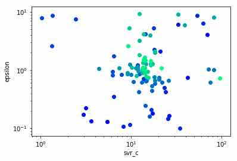

# まえがき

PFNが数日前に[Optuna](https://research.preferred.jp/2018/12/optuna-release/)というハイパーパラメータ探索ライブラリを公開した。\
早速大人気で、いくつも"試してみた"記事が上がっており、いつもすごいスピードで記事をアップしていることで個人的に尊敬しているkoshianさんも[記事をアップしている](https://qiita.com/koshian2/items/1c0f781d244a6046b83e)。

この記事を補完する形で、Optunaのハイパーパラメータの探索の様子を見てみたい。

# 色付きハイパーパラメータプロット

*以下コードは、こしあんさんの記事の続きです。こしあんさんの記事または[こちら](/python/optuna-koshian-reference.py)のコードを読んでから入ってください。*\

Optunaには、訓練の履歴をdataframeで返してくれる機能があり、これは使い勝手がいい。

```python
df=study.trials_dataframe()
df.head()
```


というわけで、訓練時データが以下のように取り出せる。

```python
df.params.svr_c
```

```out
0     0.226523
1     0.129864
2     0.135452
3     4.126573
4     0.172044
5     0.182897
6     0.753021
7     6.119761
8     0.167092
9     2.091225
10    0.146296
...
```

なので、

```python
import matplotlib.pyplot as plt
plt.xscale('log')
plt.yscale('log')
plt.scatter(df.params.svr_c,df.params.epsilon)
```
でこしあんさんの記事と同じ図をpythonだけで得る。


ここ~~で終わると流石にパクリ記事の誹りを免れないの~~で、matplotlibならではの工夫をしてみたい。\
matplotlibはプロットするときに色を指定することが可能である。くわしくは[こちらの記事](https://qiita.com/hokekiyoo/items/cea310b2c36a01b970a6)が参考になったので参照されたい。\

今回は自分の好みによりwinterグラデーションを用いた。これは、

```python
import matplotlib.cm as cm

for i in range(100):
      plt.scatter(i,1,color=cm.winter(i/100.0))
```


のように青から黄緑へと変化する。

```python
plt.xscale('log')
plt.yscale('log')

for i in range(100):
      plt.scatter(df.params.svr_c[i],df.params.epsilon[i],color=cm.winter(i/100.0))
```


また、少し時間はかかるが1000回回すと


こうなる。

# 考察

自分の環境では100回探索を回した結果が `{'svr_c': 16.532580995628685, 'epsilon': 1.4363161046754174}` だったので、たしかにただの線形探索ではなくいい感じの場所を重点的にチェックしているのが確認できる。\

更に、最初のあたり（青色）では広い範囲をチェックしていること、\
また、一度尤もらしい場所を見つけたあとでも**中心ばかりではなくときどき変な値もチェックしてみたりしている**ことがわかる。\
なお、２枚目では２００回目くらいまでは青色に含まれているので少し分かりづらいかもしれないが、１枚目と比べると後半９００回できちんと「ダメそうな場所」もより細かく探索していることがわかる。

[自分が以前に翻訳した勾配ブースティングに関する記事](https://woodyzootopia.github.io/2018/10/29/kaggle-masterが勾配ブースティングを解説するよ/)を初めて読んだときは『勾配ブースティングすげえ！最強かよ』となったものだ。\
しかし勾配ブースティングとは**とどのつまり勾配降下法**であり、 *一つ前の状態よりもうちょっと良さげな場所へ、と移動していくことを繰り返している* だけである。一つ以上前の情報を利用していない。

それに対し、[PFNの記事](https://research.preferred.jp/2018/12/optuna-release/)によるとOptunaは"Tree-structured Parzen Estimator"なるアルゴリズムを使うことにより「次の試行で試すべきハイパーパラメータの値を決めるために、完了している試行の履歴を用いて効率的に枝刈り探索をすることができる」とされている。\

終盤の方になっても**序盤の結果を覚えておき、探索したほうが良さそうな場所にチェックしに行く**という行動は、勾配降下のそれとは異なるものであり、興味深い。\

特に、ハイパーパラメータがどのように損失関数に影響するのかは人間の直観が及びにくいと考えられるため効果が高そうだ。

こしあんさんも述べているが、計算量がそこまで重くないが認識能力も高いXGBoostやLightGBMのような勾配ブースティングモデルと組み合わせると、ハイパーパラメータ探索が非常に楽になり、高い性能を発揮すると思われる。\

先に述べたようにまだベータ版が公開されて数日なので、まだお試し記事しか出てない状況だが、今後Kaggleなどのコンペティションでどのような結果が出てくるのか非常に楽しみだ。
