今回紹介するのは次の論文。\
[Image Inpainting for Irregular Holes Using Partial Convolutions](https://arxiv.org/pdf/1804.07723.pdf)\
[Partial Convolution based Padding](https://arxiv.org/pdf/1811.11718.pdf)

両方NVIDIA社の論文であり、後者は11月末に発表されたばかり。前者はECCV 2018に採択されている。

アイデア自体は単純なので次の節だけでも読んでいってほしい。

# どんなもの？

CNNに**「ここが欠損していますよ」という情報を伝えながら**学習・推論することで、より性能をあげれるんじゃね？というもの。

具体的には、欠損部分をマスクしてやり、推論の材料に使わせないようにする。

# 先行研究と比べて何がすごい？

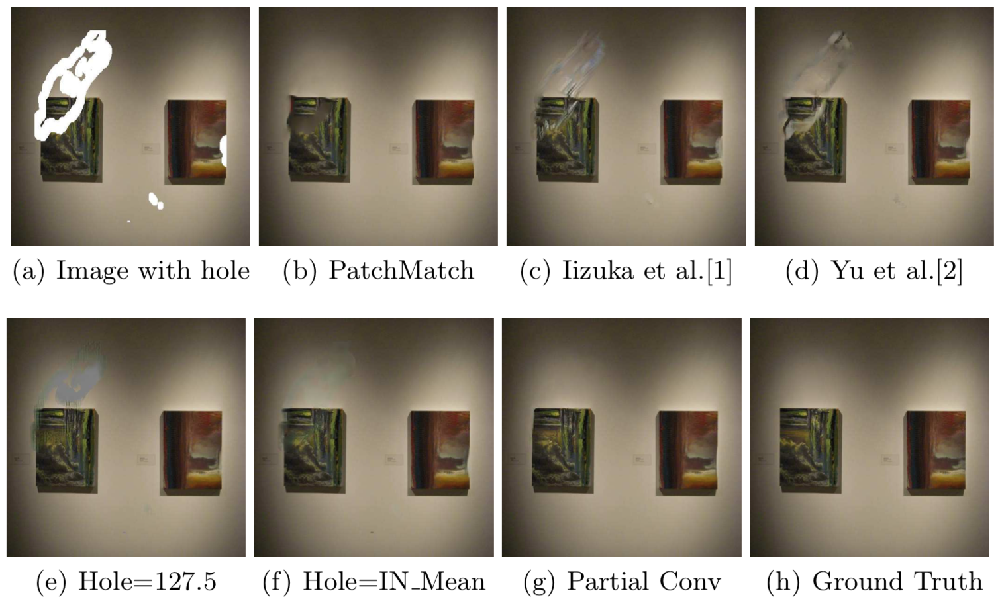

aのような穴開き写真を補完する事を考える。hが元画像である。
統計学的手法で復元したのがbで、**意味論的推測をしていないために**絵の部分がボヤケてしまっている[^1]。\
[^1]:敵対Discriminatorをつけなかった生成器でも似たような現象が起きますね。

Post Processingを用いるということもできるが、c,dのように違和感の残る画像になってしまう。

さて、ディープラーニングの登場だ。U-netを用いると、e,fのような画像が生成される。\
eでは欠損部分を127.5（灰色）で塗りつぶし、fでは平均値で塗りつぶした上で復元させている。\
しかし、どちらもよく見ればやはり変なことに気づく。[^2]\

[^2]:fのほうは頑張っていますが、白い壁の部分に違和感が出ています。この画像の平均値は白ではないので仕方ないですね。

というわけで、**そもそも欠損部分を単一色で埋めることに問題があったのではないか**という事が考えられる。

提案手法**Partial Convolution**を用いたU-netライクなモデルだとgのような画像が生成される。これは一番いい感じに見える。つよい。\
この記事のトップにある画像もPartial Convolutionで生成されたものである。
なお、これまでの手法がうまく行っていたものの多くは**「画像の中心に四角い穴が空いているものを復元する」など、欠損の形状が限られていた**ため、欠損の形状によらず対応できる今回の手法はその点でも優れている。実用上、欠損の形状が同じということはあまりないからだ。

また今回の手法では、下図に示すように、大きな欠損があってもぐちゃぐちゃな画像を生成してしまうということはない。
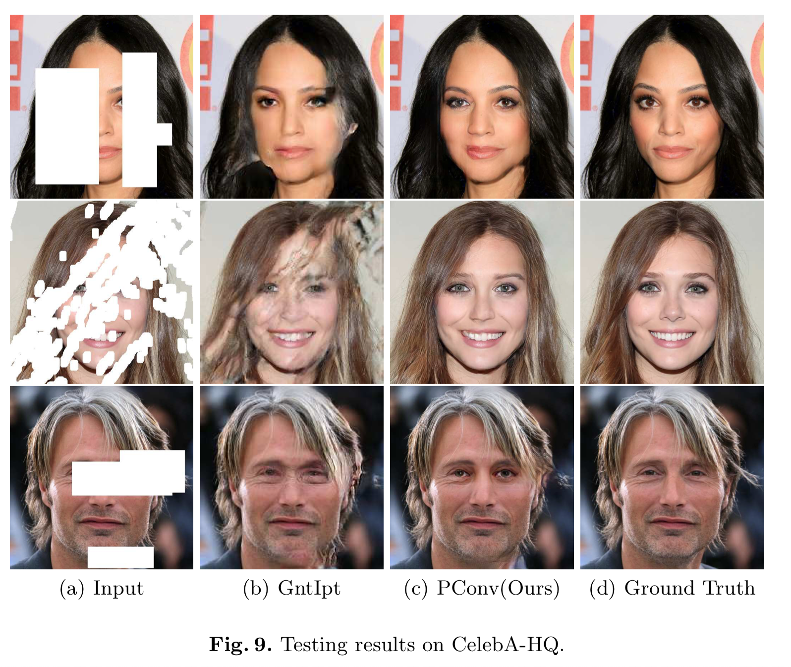
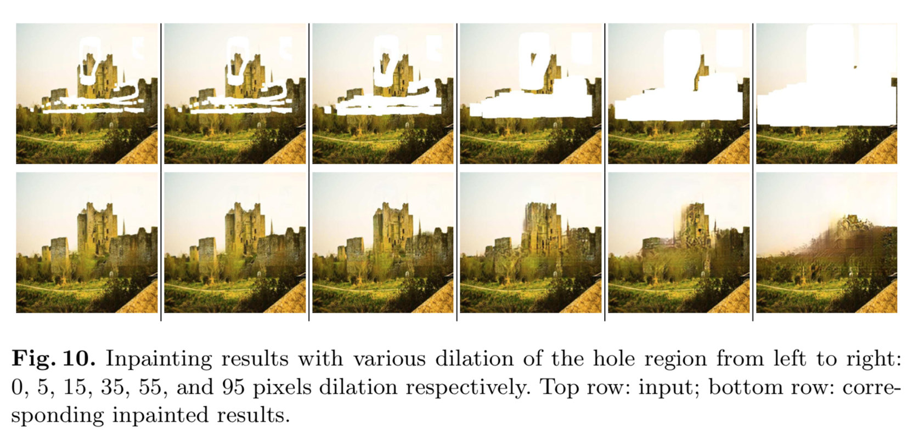

# 技術・手法の肝は？

CNNの学習時に、入力画像$X$に加え対応するバイナリマスク画像$M$を一緒に与える。$M=0$のところは欠損していることを意味する。欠損しているところは無視してコンボリューションするので、コンボリューション層の重みを$W$と書いて
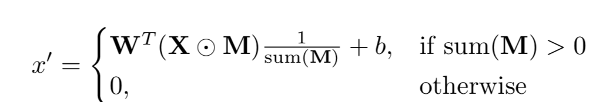

ただし、$sum(M)$は**コンボリューション範囲の$M$の合計値**とする。これで割ってやることでNormalizeしているわけである。

また、**マスク画像も更新する**。具体的には、対応する特徴量が少しでもマスクされていないところから計算されていたら、その部分はマスクではなくなる。\
すなわち、マスクされて欠損している領域は**どんどん狭くなる**ことになる。そのため、**十分な量のコンボリューションを経ればマスク領域は消滅する。**
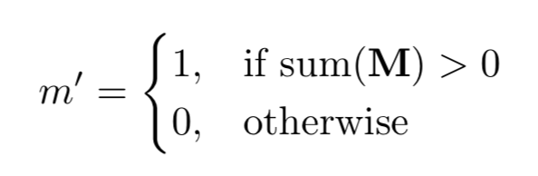

なお、この手法は**既存のネットのConvolutionをPartial Convolutionで取り替えるだけなので実装が簡単**というのもメリットである。

２つ目の論文も使われている技術は同じで、Paddingを定数値ではなく**Paddingされた場所はMaskされている=欠損している**とみなす、というだけのアイデア。

Paddingが非常に有用なのは皆さんご存知のとおりで、画像の大きさを揃えるためや端っこまでしっかりConvolveするために行われるが、その際に**0や平均値で埋める**という手法が取られることが多かった。しかしそれが悪影響をもたらすのは上の図で見たとおりであり、下図にもその悪影響の様子が現れている。
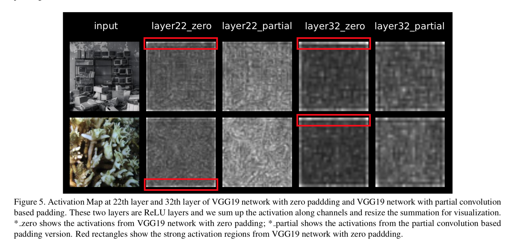

これが現れる例としてtile-based evaluation[^3]がある。これをすると画像の「端」に相当する場所がすごく増えてしまうため性能が低下してしまうが、先に述べたようにPartial Convは端っこにつよいので、いい感じになる。
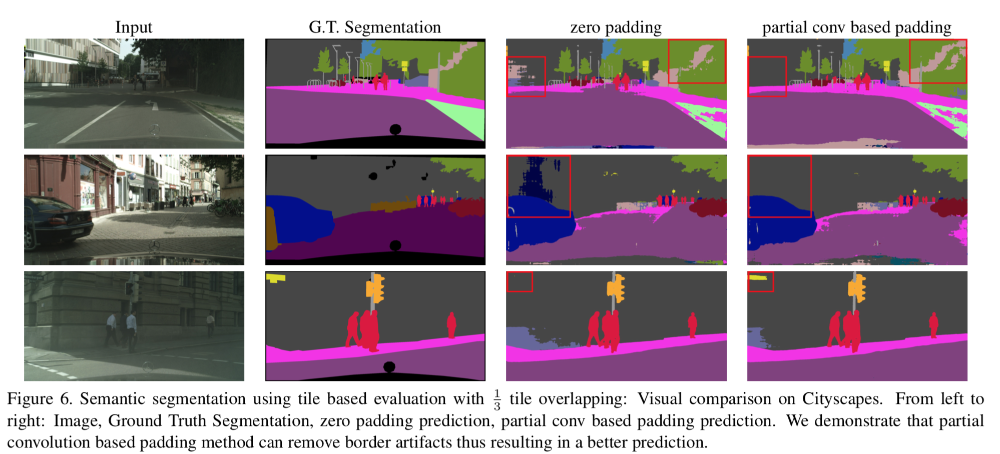

[^3]:調べてもよくわからなかったのですが、論文の内容から推測するに画像を切り分けたあとに重ねながらひっつける手法みたいですね。3割くらいを重ねながらやることで「端」をぼかす手法が使われていたんですが、**そんなことしなくてもPartial Convでなんとかなる**らしいです。

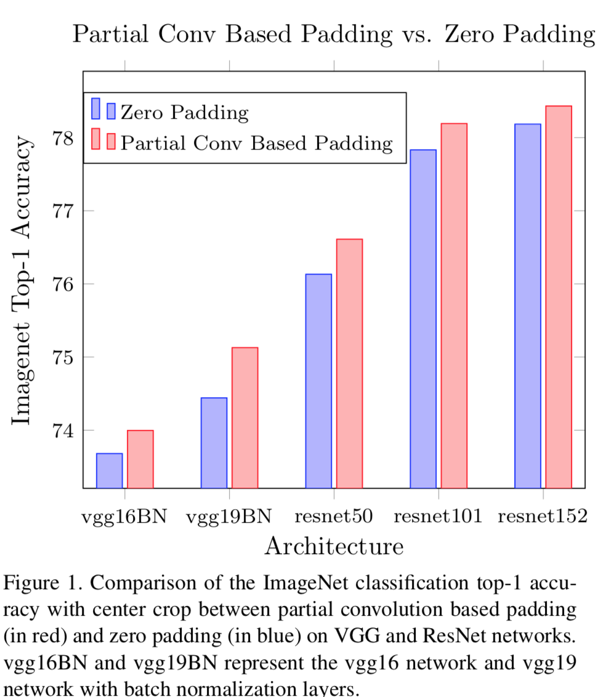

# 議論・今後の展望

１つ目の論文（欠損領域補完）で指摘されている欠点として、構造物の推定に失敗しやすというものが挙げられていた。
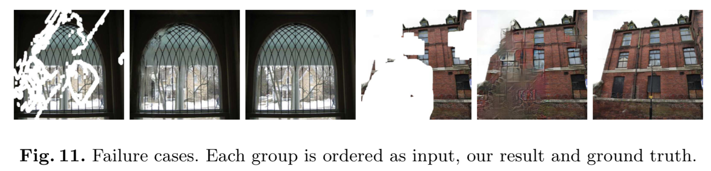

また、今後の展望として、**超解像**への応用が効くかもしれない。すなわち、下図のように画像をdilationで広げ、**空いたところを欠損値としてMaskしてPartial Convしてやる**だけ。\
**欠損領域がどんな形であっても対応できる**という今回の特長をうまく活かした結果であろう。頭いいなあ。
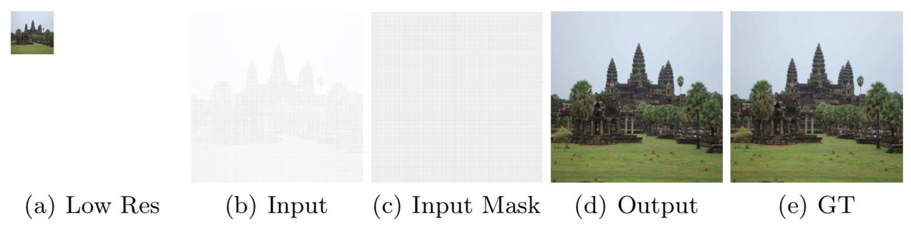

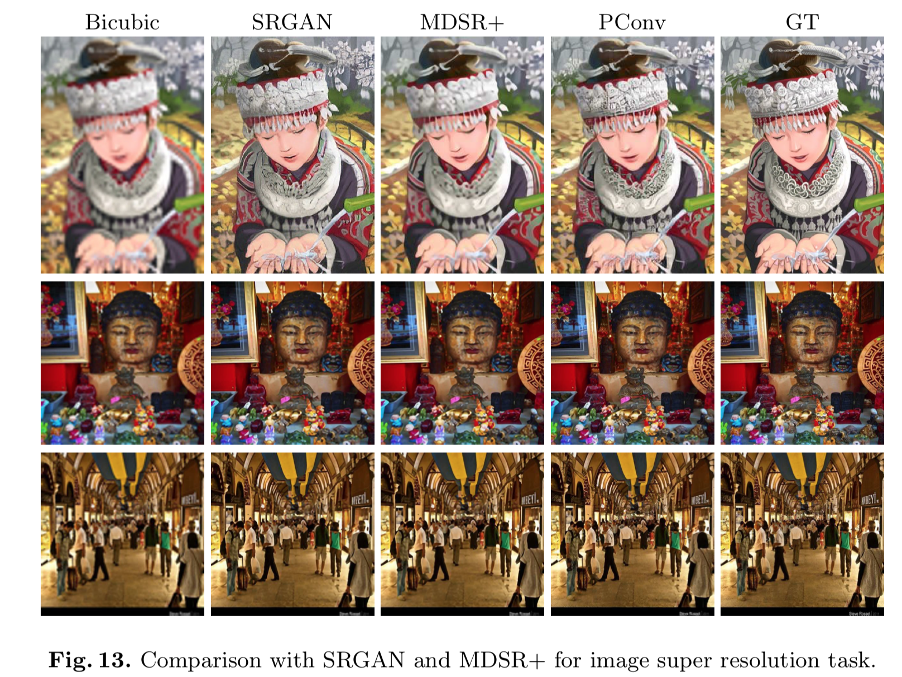

# 感想

いやーすごい。たしかに画像が欠損しているところを同じ値で埋めるのはどう考えてもおかしいけど、そこに単純に対応してやるだけでこんなにも面白い結果が生まれるんですね。コロンブスの卵だ。

そういえば、神戸大のチームがちょっと前に提案した[RICAPというデータ水増し手法](https://arxiv.org/pdf/1811.09030.pdf)があるんですけど(原理自体は非常に単純なのでぜひこちらも読んでみてください。[こしあんさんのこちらの記事が参考になります](https://qiita.com/koshian2/items/1a6b93ee5724a6d63730))。\

これでつなぎ合わせた部分って**どう考えてもConvolveされるべきではない**じゃないですか。というわけでそこが**Convolveされない程度の幅だけマスクしてやる[^4]**と性能が上がると思うんですけどどうなんでしょうね？\

[^4]:周りだけでなく、十字形にさらにマスクを加えることになります

いつか試してみたいと思います。でも時間がなくてできないかもしれないので、すでにやってる人がいたら教えてください。
