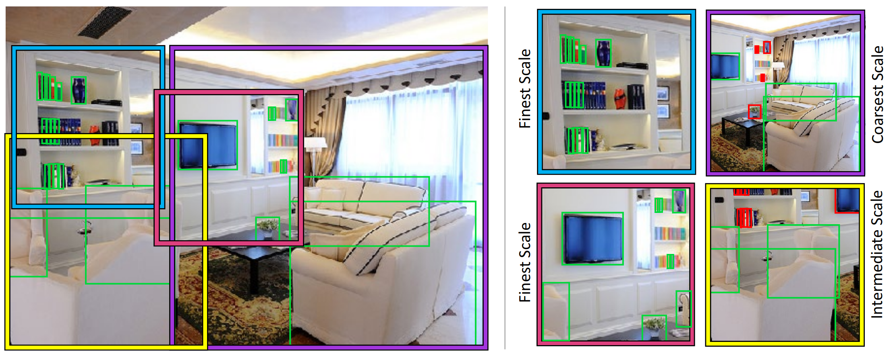
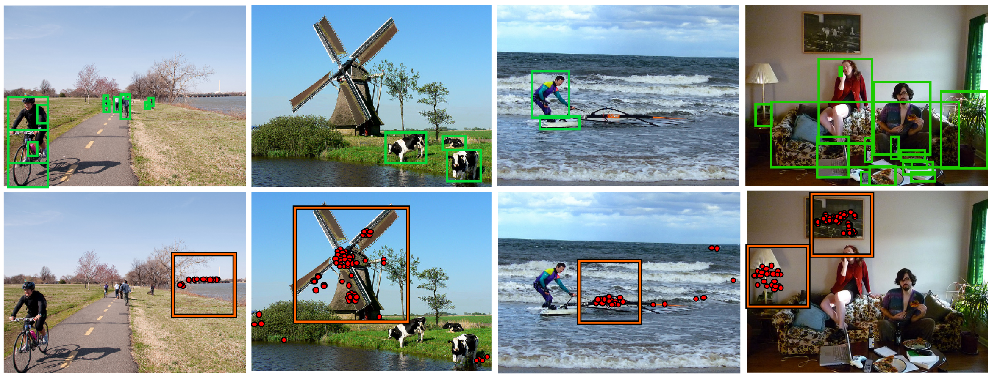
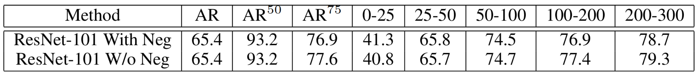
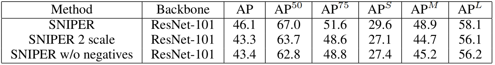
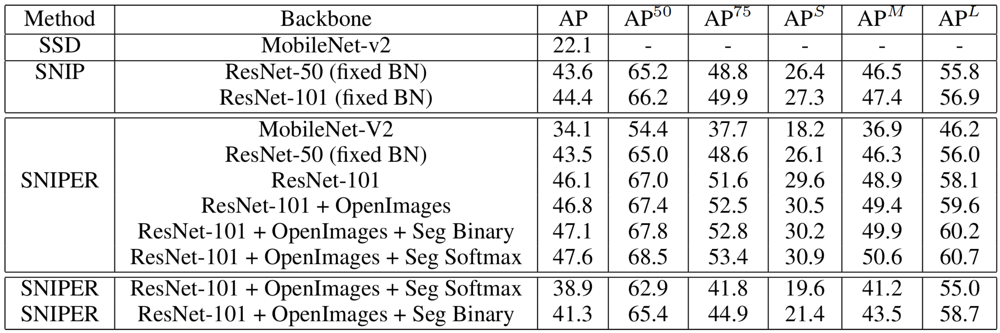

**訓練手法**を提案した、プラクティカルな論文。そのため、難解な数学はあまりなく、直観的な説明がおおかった。  
multi-scale訓練時に画像の一部をいい感じにサンプリングして、解像度を下げておくことによって、単GPUでも20images/batchで訓練できるようになり、batch normalizationの恩恵を受けられるようにしたというメリットがある。

# 概要

難しい物体検出タスクは、高い解像度で画像全体に対して訓練するのが良いとされていた。しかし、これを処理するのは計算量が大きく、特に常人のGPUではバッチ数を増やすのがほぼ不可能だった。

そこで、画像の一部を切り取り、512x512にリサイズして、それを食わせて訓練するようにした。このリサイズされた箱を**chip**と呼ぶ。

# 仕組み

## positive chip生成

* いくつかのスケール$s\_1, \ldots ,s\_n$に対して、画像を$(W_i, H_i)$にリサイズし、$K\times K$ pixelのchipを$d=32$ pixelずらしながら、chipの候補を作る。
* それぞれのスケールに対して、どのGTが含まれるかを決める
	* GTの面積が$\mathcal{R}^i =\left[ r\_{min}^i, r\_{max}^i \right]$に入っていれば、GTはスケールに対してvalidとよばれる。そのようなGTを$\mathcal{G}^i$とする
	* $\mathcal{G}^i$がすべていずれかのchipにカバーされるように貪欲法でchipを選ぶ
		* 「カバーされている」とは完全に箱が含まれているということ
	* 選ばれたchipの集合を$\mathcal{C^i\_{pos}}$と呼ぶ。
	* chip内に（意図せず）一部が含まれてしまったGTはcropされていると呼ぶ。これも正解データとして含めるが、カバーされている判定にはならない

こうすることで、すべてのGTが適切なスケールのチップに必ず含まれているようにできる。チップの解像度は画像自体より非常に小さい（画像が高解像度ならば、一番小さいもので10x以上）ので、ほとんどの背景を高解像度状態で処理することはない

### 補足
* 同じGTが複数のchipに含まれることがある
* $\mathcal{R}^i, \mathcal{R}^{i+1}$にはカブっている部分があるので、おなじGTが$\mathcal{G}^i, \mathcal{G}^{i+1}$両方に含まれることがある

## negative chip生成

* これだけだと、背景が使われないので、False Positiveに非常に弱くなってしまう
* アトランダムに選ぶのでは、easy sample（簡単に背景とわかるもの）ばかりになってしまう

なので、次のようにする。

* RPNを数epochs適当に訓練する。この時negative chipは使わない。
* 当然、false positiveに弱くなる=FPをたくさん検出してしまう。**だがそれでいい**
* このRPNを全訓練データに適用、Proposalのリストを得る
* このうち$\mathcal{C^i\_{pos}}$にカバーされているものは本物の可能性が高いので除く。そうでないものは「Positiveっぽさがあるが実際にはそうではない部分」
* $\mathcal{R}^i$のなかで$M$個以上のproposalを含むようなchipをあつめ、$C^i\_{neg}$とする。これを保存（プール）しておく
* 実際の訓練では$\cup ^n \_{i=1} C^i\_{neg}$のプールからも何個か取り出すようにする

## 訓練時のラベリング

訓練時は、chipに含まれている *すべての* GTで訓練する。すなわち、GTがchipの$\mathcal{R}$に入っていなくても訓練に使う。

* 例えば、小さいchipに巨大な物体の一部がクロップされて入っていたら、それに対する検出結果も使いたいので

## メリット

訓練時には、データセット全体からランダムにchipをサンプルする。scaleは$(512/ms, 1.667, 3)$（ただし、$ms=\max(width, height)$）

* 画像の短辺が512より小さい場合は、ゼロパディングする

平均して512x512のchipsを5個程度生成。

計算量は多そうに見えるが、上述のように画像の一部を、それも縮小した状態で訓練するので、pixel数ベースでの計算量は単純に全体を処理するときに比べ30%増加ですむ（COCOの場合。COCOは画像サイズが800x1333）。  
実際には、画像サイズが同じになっているので、データがより良い感じに処理でき、30%の増加は簡単にひっくり返る。

まとめると、**multi-scaleな訓練、大きなバッチサイズ、batch normalizationの恩恵を計算が遅くなることなしに8GPUで受けられるようになった**。

これまで、高解像度のまま処理することが物体検出のタスクには必要と考えられてきた

* そのときバッチ数を増やすために必要だったマルチGPU法も、遅かったりといろいろ問題があった

しかし、提案手法がうまく行ったことから、**negative sampleと巨大サンプルが適切に含まれていれば**、COCOのような難しいデータセットに対しても訓練可能ということが示された。ある程度の視野より広い範囲のコンテキスト情報は不要か。

# 実験の詳細

* COCOデータセット
* $\mathcal{R} = (0, 80^2), (32^2, 150^2), (120^2, \inf)$
* 6 epochs訓練, 1 epoch = 11000 iterations
* FP用RPNは2 epochs訓練、1 epoch = 7000 iterations
* よって、RPNの訓練は全訓練時間の20%以下。嬉しいポイント
* 他にも、mixed precision trainingなど、訓練のコツが色々細かく書かれていたので興味のある人は論文を読んでほしい

## 結果

* ARは$C^i\_{neg}$を使うか否かとは関係がなかった
* RecallはFPの量とは関係がないためと思われる

* 一方で、APにはもちろん効果がある
* スケールを減らす[^how are they decreased]と性能が大きく下がる→multi-scalingは訓練に効果的ということがわかる

[^how are they decreased]:$(512/ms, 1.667)$ に減らした

* 効率的なバッチ推論パイプラインによりV100 GPUで5 image/sec 処理できた
* 性能も、特にMobilenetv2で大きく向上した
	* Image pyramidの重要性（および、それを積極的に使えるSNIPERの強さ）を示した形になる

# まとめ
賢いchipsの生成により、効率的に訓練することで訓練時間を短くしつつバッチ数を上げるなどして性能向上にも寄与する訓練手法。
ただ、論文中ではFaster-RCNNにのみ適用されているので、SSDなどのOne-stage detectionの手法に適用できるかは疑問

*この記事はMETRICAの社内勉強会のために書いたものです*
