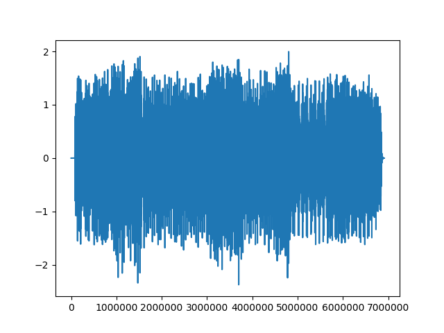
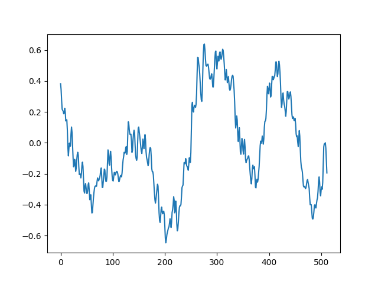
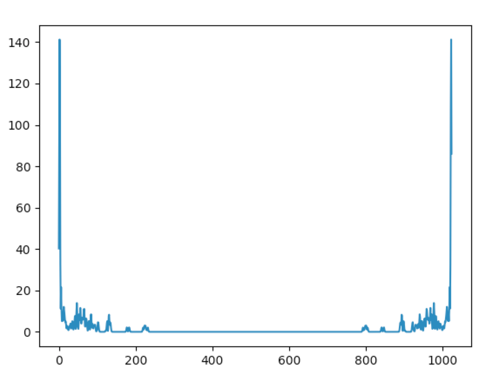
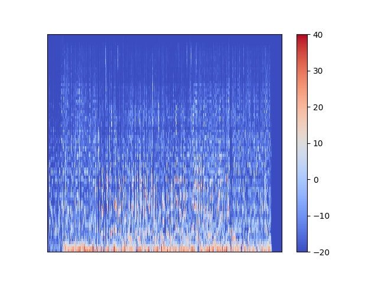
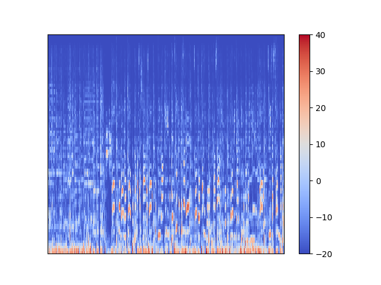
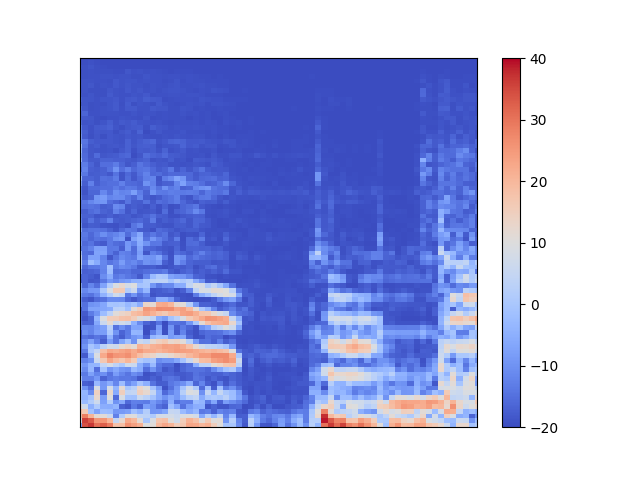
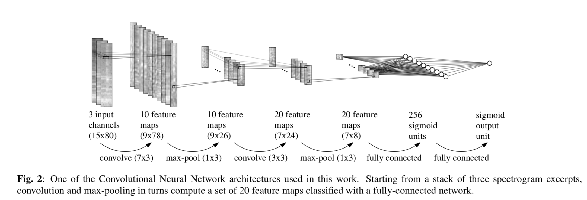

# 結果
見て（聴いて？）もらうと早いと思います。これは今回作ったモデルで生成した譜面を太鼓さん次郎2で演奏したものです。

米津玄師さんの「ピースサイン」：
<blockquote class="twitter-tweet" data-lang="en">
「音楽から全自動で太鼓の達人の譜面を作るAI」を作りました  またいつか解説記事書きます <a href="https://t.co/IW6qrd9knS">pic.twitter.com/IW6qrd9knS</a>
&mdash; うっでぃ (@woodyOutOfABase) <a href="https://twitter.com/woodyOutOfABase/status/1018708633511575553?ref_src=twsrc%5Etfw">July 16, 2018</a></blockquote>

UndertaleよりToby Foxさんの"Your Best Nightmare"
<blockquote class="twitter-tweet" data-lang="en">
<a href="https://twitter.com/no_TL?ref_src=twsrc%5Etfw">@no_TL</a> <a href="https://t.co/UW5ntQg0KC">pic.twitter.com/UW5ntQg0KC</a>
&mdash; うっでぃ (@woodyOutOfABase) <a href="https://twitter.com/woodyOutOfABase/status/1020254442908610561?ref_src=twsrc%5Etfw">July 20, 2018</a></blockquote>

kinonoさんの"piano song":
<blockquote class="twitter-tweet" data-lang="en">
<a href="https://twitter.com/no_TL?ref_src=twsrc%5Etfw">@no_TL</a> <a href="https://t.co/TDcN9IiJHM">pic.twitter.com/TDcN9IiJHM</a>
&mdash; うっでぃ (@woodyOutOfABase) <a href="https://twitter.com/woodyOutOfABase/status/1020254846648139776?ref_src=twsrc%5Etfw">July 20, 2018</a></blockquote>

https://www.youtube.com/watch?v=RS7AV-J0VMg

悪くないですね。課題としては、Your Best Nightmareの中盤に顕著ですが、ノーツの音色によっては"カッ"に偏ったりすることでしょうか。これは、後述するように、今回のモデルはその瞬間だけの情報から推測しているので、全体のバランスを考えて配置したりはしないからです。

# 今回取り組んだ課題

これを行うためには2つのことをすることが必要です。

1.音の出だし位置を音楽から特定すること
2.その音が「ドン」と「カ」のいずれかを分類すること

ちなみに、1はOnset Detection（日本語でなんというのか知りません）という割と昔からある問題の一つです。
ディープラーニングといっても様々な手法が存在しますが、どのようなモデルを使うことが適切でしょうか。音声データは明らかに時系列データなので、簡単に思いつきそうなものはLSTMやGRUなどのRNNを用いる方法でしょう。しかしもう一つよく使われるものとして、画像処理によく使われるCNNをこれに適用するというものがあります。今回はそれを用いました。
参考にした論文に[Dance Dance Convolution](https://arxiv.org/abs/1703.06891)があるのですが、これでは一度Onsetの検知を行なってからその分類を行なっていました。しかし今回は面倒だったのと技術的な制約によって直接分類まで行いました[^9]。

[^9]: 驚くべき副作用として、直接分類まで行うようにすると、精度がかなり向上しました。（lossを記録するのは忘れてました、すみません）。ドンとカの区別は割と大きな情報を持つようです。~~ナムコの中の人が適当に打ってるだけだろって馬鹿にしてました~~

# 手法

## 前処理（ここは音声処理一般に応用できます）
まず、音楽データを用意します。

それを細かい時間（0.01-0.04秒程度、正確には512-2048サンプル）取り出します。下図は512サンプルです。

それをフーリエ変換にかけて周波数別の強度を算出します。

（厳密にはここから半分だけを取り出せば十分です。音響処理においてフーリエ変換時の位相はあまり意味がないことが知られているので、このグラフは絶対値を取り出したものだからです。フーリエ変換を学ばれた方ならご存知のように、$F\_k$と$F\_{-k}$は共役複素数の関係にあり、絶対値は同じです）

これを人間に聞こえるのと同じ尺度へと変更します。具体的には、周波数の情報がこれだと512個もあるので、80個ほどに減らしてデータ量を削減すると同時に、$log\_{10}$を取ります[^1]。
[^1]: 80個に減らす際にはMel Filter banksを用います。行列の積で簡単にかけます、詳しくは[ここ](https://haythamfayek.com/2016/04/21/speech-processing-for-machine-learning.html)を参照してください（実際、人間の耳にある蝸牛では長さの微妙に違う繊毛が固有振動数の違いにより様々な周波数に特異に反応することで音を聞いているらしいです）。記事にあるように、音声認識をさせたいときにはさらにケプストラムという量に変換するのですが、今回はやっていません。

さて、この一連の作業を0.01秒ずつ（これも正確には512サンプル）ずらしながら曲全体に対して行います。横軸を時間、縦軸を周波数とすると次のような図が出てきます。

これをメルスペクトログラムと言います。右端の部分が真っ青になっていますが、これは曲が終わって音が鳴っていないことに対応しています。さて、これでは時間が長すぎて何がなんやらわからないので、もう少し細かくみてみましょう。

さらに拡大してみます。

ある程度の時間に渡って強度が高くなり色が赤くなっているのが見て取れますね。この赤くなっているところが音が鳴っているところです。赤くなっているところが時間が立つにつれ上下に変化していたら、それは音の高さが変わっているということです。
これを「画像」とみなしてCNNで処理してやることでOnset Detectionをしてもらおうっていうのが今回の試みです。
もう少し細かくいうと、この画像は縦（＝周波数方向）80ピクセルの解像度があるので、処理したいフレーム±7フレームの、80x15の画像をCNNに渡します。サンプリングする長さを約0.01秒、0.02秒、0.04秒にしながらこの作業を行うことでタイムスケールの違う情報を与えてやります（例えば、ほんの短い間に突発的に起こる太鼓の音は、短いタイムスケールによって捉えられるでしょう。逆に、長いタイムスケールのものはより広い範囲の情報を含んでいます）。
これで80x15x3の画像ができました[^8]（3のところは画像処理でいうRGBチャンネルのようなものと考えれば良いでしょう）。そして、そのフレームが音の出だしか否かを[0:1]の正解データとして与え、これを予測させます。

[^8]: 上のピースサインの予測結果をツイートした時、「揺れてる」というご意見をいくつかいただいたのですが、ここまで読めばわかるように±数秒の情報しか知り得ない今回のモデルはリズムとかそういった概念をほとんど持たないので、揺れるとは考えづらいです。~~そもそも勝手に揺れると損失が上がりますし。~~揺れているのは演奏の方ではないでしょうか？

正解データは0と1のいずれかで、音の出だしの瞬間にだけ1となります。しかし、実際には0.01秒レベルの正確さ[^5]で正確にOnsetが存在するとは考えづらいので、今回は±1フレームのところの正解を0.25としています。

[^5]: 人間に区別できる最高の精度が0.01秒と言われています(https://ieeexplore.ieee.org/document/1495485/ の参考文献1)

## データセット
ご存知の方も多いと思いますが、ディープラーニングには大量のデータセットが必要です。今回の学習のためには、音楽データ、およびその曲に対応した「音の出だし」が正確に記録されたデータセットが必要となるでしょう。
そこで登場したのが**音ゲーの譜面データ（ノーツ）**をデータセットに用いようというアイデアです。確かに、音ゲーにおいてノーツは「プレイヤーが叩くべきところ」ですが、その位置は音の出だしを示しています。
このアイデアは~~残念ながら~~自分のものではなく、先ほども紹介した論文[Dance Dance Convolution](https://arxiv.org/abs/1703.06891)が多分初出です。この論文ではDDR（ダンスダンスレボリューション）というゲームの譜面データを利用しています。
しかし、これを直接太鼓の達人に適用するだけだとあまりうまく学習してくれません。なぜでしょうか。本当のOnset（またはDDRのノーツ）と太鼓の達人のノーツの違いとして、

・太鼓の達人にはすごく速い連打がある。特に、「ら〜〜〜〜」といったロングトーンのところを連打しがち（実際には先頭に一つだけで良い）。DDRは人間がステップを踏むための譜面なのでそのような連打は存在しない（長押しが存在するが）。
・音がなっていても叩かないところがある。特に"ノッて"いない序盤で顕著（これはDDRにもみられるかも？）。

が考えられます。これを解消するために、「時間差が0.1秒以上0.7秒以下の二つのノーツの間の区間」のみを抽出しました[^2]。これにより、過度な連打ノーツやノーツのない区間を無視することができるので、より本当のOnsetに近づけることができそうです。
[^2]: ただ、よく考えるとこの工夫によりこのデータセットは「太鼓の達人の譜面データでない何か」に変容していることになるので、あまり良い工夫ではないかもしれませんね……。

この太鼓の達人のデータを150曲ほど用意しました。

## CNNのモデル
モデルおよび前処理は基本的に[IMPROVED MUSICAL ONSET DETECTION WITH CONVOLUTIONAL NEURAL NETWORKS](https://ieeexplore.ieee.org/document/6854953/)に従っています。簡単なCNN+Denseニューラルネットです。

前述のDance Dance Convolutionでも独自のモデルR-CNNが提案されているのですが、これは使用しませんでした。このモデルは長い区間（100-200フレーム=1-2秒ほど）のデータを一気に与え、CNNの後にLSTMを用いて推論するというものなのですが、先に述べた抽出作業のために、今回のデータはぶつ切りになっており、十分な量の学習データが与えられるか不明だったためです。

# 感想
Pytorch・音楽処理の練習を兼ねてゼロから書いたのと、大学の勉強とかサークルが忙しかったので制作に2ヶ月以上もかかってしまいました。おかげでPytorchはだいたいわかりましたが……
次はもっとスピーディに作りたいですね。

選んだデータの特徴（太鼓の達人にはポップ曲が多い）もあるのかもしれませんが、ゆったりした曲ではミスが少し多かったように思います。一方で、激しい曲や、ドラムセットのわかりやすい曲ではよく叩けていました。人間がここから適切なものを選んでやれば簡単に譜面が作れそうです。音ゲーの作譜を簡単にしてくれそうですね。[^3][^7]

なお、図を見ればわかるとおり今回のモデルは計算量・メモリともに軽めです[^4]。画像認識系のタスクはどうしてもデータ量が多くなるので、GPUでぶん殴らないといけなかったりするのですが、今回のは頑張ればCPUでもこなせるレベルとなっています。CNNを体験してみたいという人にはオススメの練習問題でしょう。[^6]この記事をきっかけに音声処理やディープラーニングに興味を持ってくれる人が一人でもいたら嬉しいです。

[^3]: Beats Gatherのような「他の人（プレイヤー）が叩いた譜面でプレイできる」というゲームがあり、僕も昔よく遊んでいました。公式に譜面の作られていないようなニッチな曲でも遊べることや、人気な曲ならばたくさんの譜面の中から選べることが魅力ですが、ネックの一つが「その人の叩いたノーツの位置がずれているとそれがそのまま反映されてしまう」というものです。これはプレイの快適さを著しく損なってしまうので、今回のプログラムと組み合わせればその辺自動で微調整できていい感じになると思うんですけどどうなんでしょうか。

[^4]: あんま覚えてないんですけど、学習時にminibatch=128でもメモリ使用量は数100MBでした。学習もGPU使用で2時間かからず終わる程度のものです。

[^6]: もしPythonを使っているなら、フーリエ変換はScipyとかがありますし、メルスペクトログラムに関しては今回使った[Librosa](https://librosa.github.io)がおすすめです。意欲のある方はぜひどうぞ。

[^7]: 元々この作品も、音の位置さえ検知できればそれでいいやと思っていました。ただ、せっかく太鼓の達人の譜面をデータセットにしているのだから太鼓の達人の譜面を作ると面白いんじゃね、となった結果が動画のやつです。
