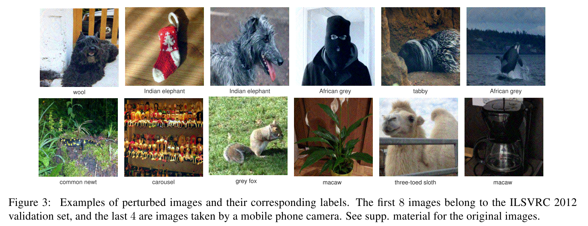
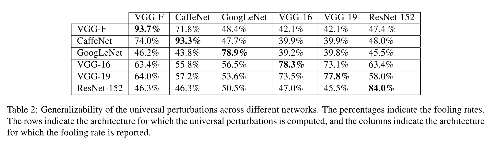
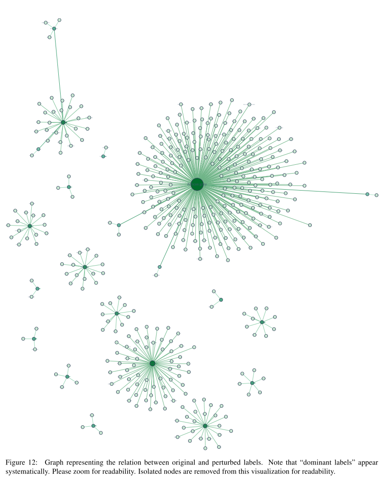
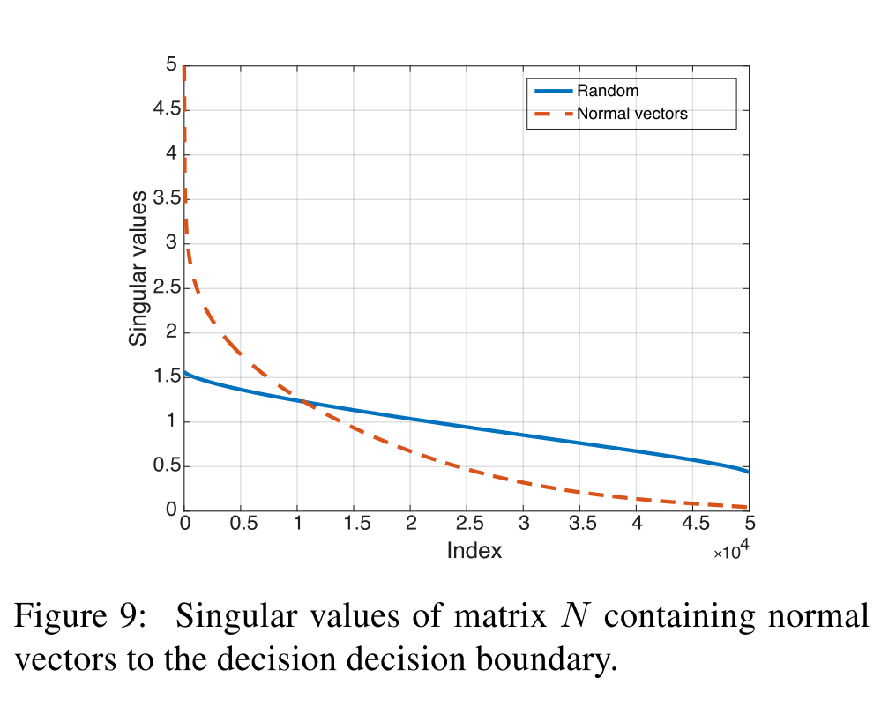
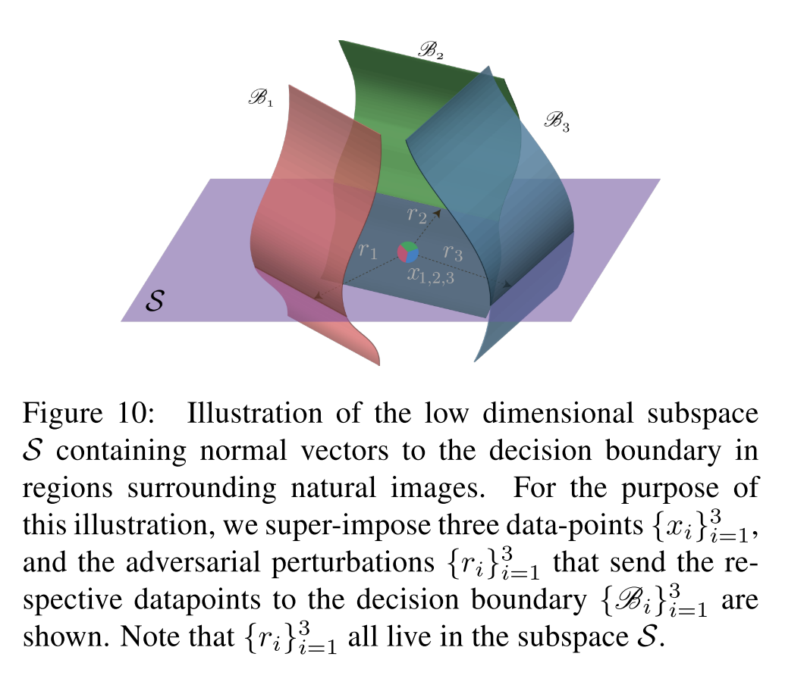

## arXiv:1610.08401v3

1. 論文の概要

  * DNNに対して、画像によらず・大きさも小さいノイズ(perturbation)を加えることでClassificationを騙すという手法の提案。また、様々なNNの構造に対しても同様に有効であることがわかり、これはすなわち様々なClassifierの高次元における分別境界にある種の相関があることを示しており、ある単一のノイズ画像が様々なclassifierを騙せてしまう可能性を示唆する。

2. 問題設定と解決した点（先行研究と比べてどこが凄い？）

  * 画像とNNの性質を知っているときに、わずかに画像にノイズを加えて騙す手法は知られていた。この論文では画像・NNの構造にindependentなperturbationを提案。

3. 技術や手法のキモ

  * そのようなpertubationを見つけるために、勾配降下法チックなiterationをする。
  * もし$x+v$で騙せていないなら、一番近い境界に新たな$\Delta v$を設定。
  * それに一番近い場所で、かつ$v$の半径が拘束条件以下に収まるものにiterationする。
  * これを各画像に対し繰り返す。騙せた割合が一定の割合を超えたら終了。このtestセットは訓練点のごく一部でもよいらしい。嬉しいね。

  * 

4. 主張の有効性検証

  * VGG,GoogLeNet,ResNet-152のような有名なネットの多くで訓練に使っていないvalidation dataにおいても８０％前後以上の「だませた」率を達成。
  * あるネットで訓練したperturbationで他のネットを騙そうとしてみたところ、もちろん上ほどの性能は出なかったが、とくにVGG-19に対して訓練したものは他のものに対しても53%以上騙せている。本論文のperturbationはある程度モデルに対してもuniversal/independentであることが示唆される。
  * 
  * perturbationによりどのラベルからどのラベルへと主に騙されるかをグラフにしたところ、多くのラベルから一つのラベルへと騙されていることが多かった。そのラベルは画像空間において大きな領域を占めているとの仮説。
  * 
  * universal perturbationを１０種ほど作って訓練画像に混ぜながらfine tuningさせたが、93.7→76.2%と大きく改善したものの依然高い誤答率だった。
  * もし境界がランダムに存在しているとしたらImageNetに対するモデルを騙すのに必要な誤差は$\xi=2000$程度ではなく20000程度になるはずである。そうなっていないということは、境界の形にある種のcorrelationが存在し、universal perturbationはそれを取り出せているためではないか。
  * これを検証するため、データセットからいくつかの点$\{x\_i\}$を取ってきて、そこから一番近い境界までのベクトルを$r(x)$として次の行列を考えた。

  * $ N = \left[ \frac{r(x\_1)}{{\|\| r(x\_1)\|\|}\_2} \dots \frac{r(x\_n)}{{\|\| r(x\_n)\|\|}\_2} \right] $
  * なお、当然$r(x)$は境界に垂直になる[^3]。
  [^3]:多分ラグランジュの未定乗数法的なあれです
  * これにSVDをかけ、特異値をプロットした[^1]。
  * 
  * 急激に減少していることが見て取れ、次元がより低いが境界に垂直なベクトルのほとんどを含む部分空間の存在を示唆する。
  * 2000種の画像でSVDし、上位１００個の特異ベクトルを抽出。別の画像セットに対して低ランク近似（ノイズの再構成）して加えたものでも、38%近くを騙すことができた。ランダムな画像では10%程であることを考えると、画像に比べて極めて低次元[^2]な「騙しやすい方向」の存在が示唆される。
  * 

  [^1]:記載されていないが特異値の最小値か。
  [^2]:使われている画像はImageNetのものなので、画像サイズは少なくとも2000次元よりは大きいと思われる。

5. 議論すべき点

  * グラフのハブになってるラベルは、大きい領域とは限らないのでは？例えば、タコの足のようにいろんな場所に伸びてる領域とかもありえそう。それか、今回のuniversal perturbationってすなわち画像をぜんぶ平行移動させるわけだから、むしろ平たい領域と考えるのが妥当なのでは。いずれにせよ仮説だしなにも検証してないのでただの妄想だが。
  * 勾配降下法チックなやり方かと思ったら、各iterationで、一番近い境界の方向に拘束条件の中で**進めるだけ進める**ようなアルゴリズムになっていた。過学習の可能性あるのでは？でもバリデーションデータではうまくいってるから問題はないのか？

6. 次に読むべき論文は？

  * 実を言うとUniversal Perturbation Attack Against Image Retrieval (arXiv:1812.00552v1)を読んでいたところこの論文が参考文献に上がっていたので先に読んだ。後でこれを読みたい。

7. 参考文献
  * [11]Deepfool: a simple and accurate method to fool deep neural networks: 更新アルゴリズムを効率的にするためにこれで提案された近似法が使われた。

8. 補足（Appendix）
  * Adversarial Exampleについて事前に理解しておくと読みやすいと思う。

以上です
