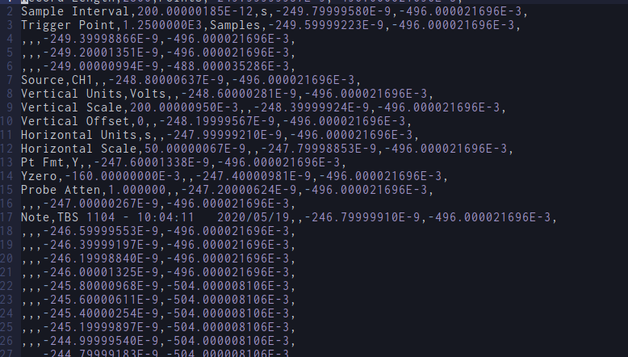
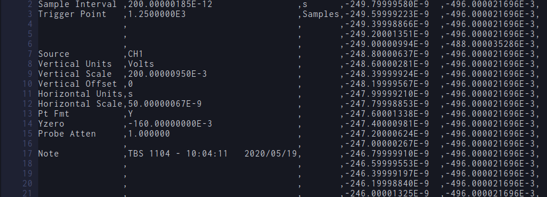

Vimmerの皆さんは世のあらゆるファイルをVimで編集したがっていると思います。

僕もその例外ではなく、今日は`.csv`ファイルを開いて編集したくなりました。

しかし、csvファイルはカンマ区切りでありvimのようなテキストエディタでは非常に読みにくいです。



というわけで、これをどうにかしましょう。こんなふうにしたいです。



よく見るのは[vim-easy-align](https://github.com/junegunn/vim-easy-align)みたいなプラグインを使う方法ですが、これにはいくつかの問題があります……

* 遅い。そもそも大量の入力をalignするためのプラグインじゃないので、（手元でやってみたところ）たった2500行ほどを処理するだけで数秒待たされます。ありえません。
* 最終的に空白を削除しないといけない（ことがある）。プログラムによっては、無駄な空白があると不正な入力とみなすため
* 外部プラグインが必要。ただCSVファイルを編集するために外部プラグインを入れないといけない

というわけでこれを解決する方法を提案します。

Linuxには`column`というコマンドがあります。これを使うと、CSVファイルを整形することができます。これをCSVファイルを開いたときに自動的に実行、その内容を開くようにしたらいいですね。これは高速ですし、多くのシステムに標準で入っています。

また、保存時には、「`,`の前の空白」を削除するように設定すればいいですね。

以上をまとめると、以下のような設定になります。

```.vimrc
augroup CSV
    au!
    au BufReadPost *.csv %!column -s, -o, -t
    au BufWritePre *.csv %s/\s\+,/,/ge
    au BufWritePost *.csv %!column -s, -o, -t
augroup END
```

それでは、Happy Vim Life!
