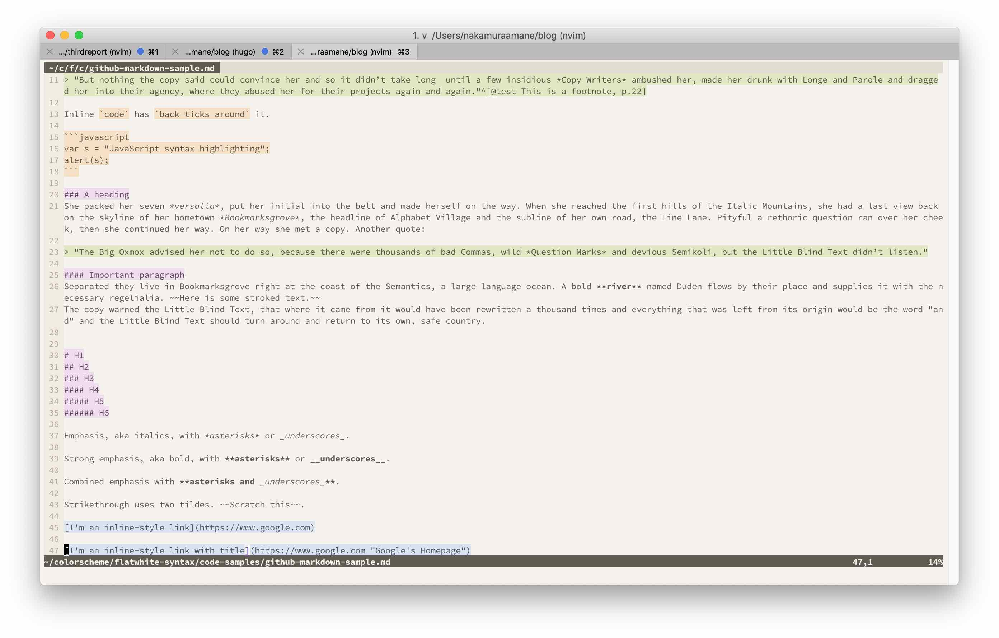
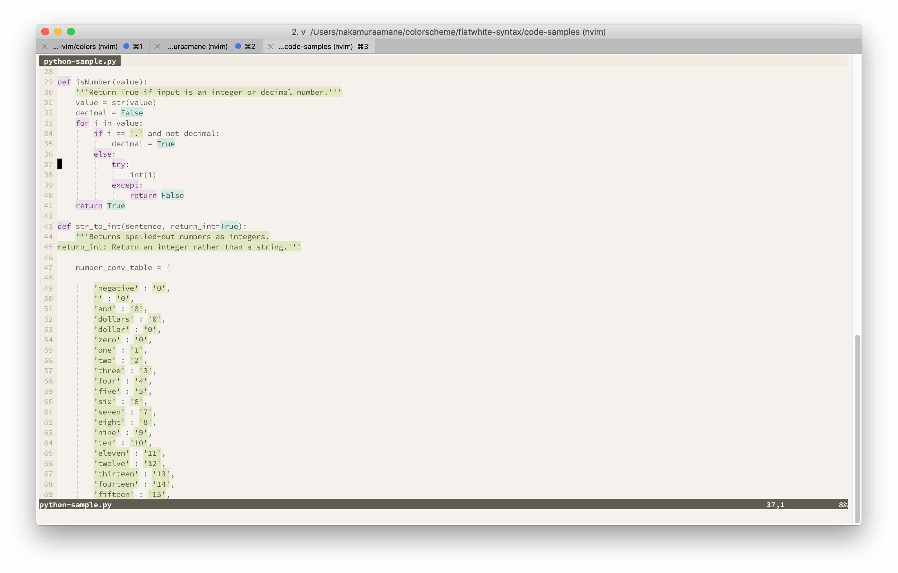
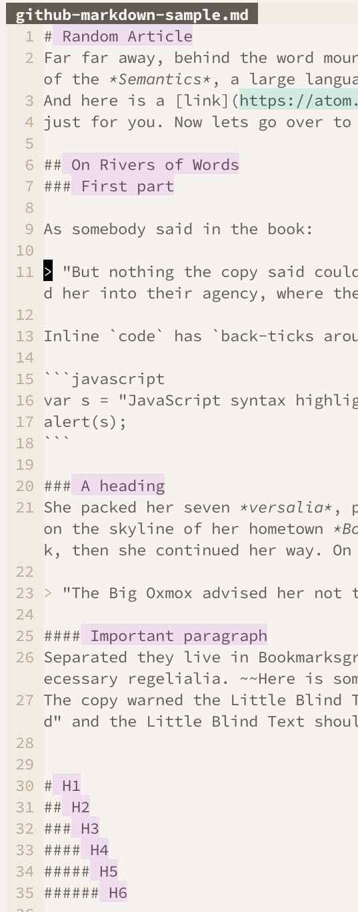
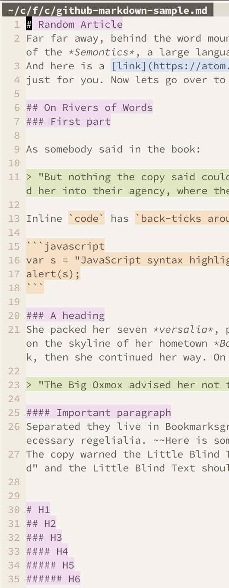

# TL;DR

Atom用のカラースキーム[flatwhite](https://atom.io/themes/flatwhite-syntax)を[Vim版に移植したもの](https://github.com/kamwitsta/flatwhite-vim)があったが、言語対応が貧弱（というかまったく未対応）だったのでフォークしていじった。\
現状、**Markdown, C, C++, Python, HTML, CSS**に対応。\
NeoVimでしか試してないですが、多分Vimでも動きます。

まだまだ未完成なので、プルリク歓迎です。(特にLaTeXを完成させたいがちょっと厄介そう)

↓リポジトリはこちら↓\
https://github.com/woodyZootopia/flatwhite-vim

# まあスクリーンショット見ろよ





すごくいい！

# どうやって使うか

[前に書いた記事](/2018/12/自分のvimのプラグイン環境設定-dein-denite-deopleteを動かすまで/)のようにして[dein](https://github.com/Shougo/dein.vim)を入れていることを前提にするが、\

1. `init.vim`に
```vim
call dein#add('woodyZootopia/flatwhite-vim')
```
と書くか\
`dein.toml`に
```toml
[[plugins]]
repo = 'woodyZootopia/flatwhite-vim'
```
と書く

2. `init.vim`に
```vim
colorscheme flatwhite
```
と書く

これでOK。

# 動機

へいほーさんのツイート
<blockquote class="twitter-tweet" data-partner="tweetdeck"><p lang="ja" dir="ltr">これに勝てるLaTeXエディタを俺は知らない <a href="https://t.co/3Ymy6zhaen">pic.twitter.com/3Ymy6zhaen</a></p>&mdash; へいほー (@5ebec) <a href="https://twitter.com/5ebec/status/1065872335108956161?ref_src=twsrc%5Etfw">November 23, 2018</a></blockquote>
<script async src="https://platform.twitter.com/widgets.js" charset="utf-8"></script>
<blockquote class="twitter-tweet" data-conversation="none" data-cards="hidden" data-partner="tweetdeck"><p lang="ja" dir="ltr">おすすめTheme:<br>Flatwhite-syntax<br><br>ライト系テーマで一番好きなやつ。文字の色を変えるんじゃなくてbackgroundを変えてくれる。目に優しいしお洒落だし文書作成に本当に合う。<a href="https://t.co/3qSIec0Ut7">https://t.co/3qSIec0Ut7</a></p>&mdash; へいほー (@5ebec) <a href="https://twitter.com/5ebec/status/1065886980653731840?ref_src=twsrc%5Etfw">November 23, 2018</a></blockquote>
<script async src="https://platform.twitter.com/widgets.js" charset="utf-8"></script>

を見てこの**flatwhite**というカラースキームに一目惚れした。シンタックスに応じて背景が変わり文字自体の色は変わらない[^mojicolor]ので可読性は高く、また彩度が低いので目にも優しい。。ライトテーマであることも高得点[^whylight]。\
だが、自分は生粋のVimmerなので、**Vim以外のテキストエディタを使うと死んでしまう**[^uso]。なのでVim版を作ることにした。

[^mojicolor]:厳密には背景の色に合わせて微妙に変わっているようだがパッと見ではわからない
[^whylight]:自分は[Webサイトでわからないことを検索しながらプログラミングする](https://www.google.com/search?client=firefox-b-ab&biw=1280&bih=703&tbm=isch&sa=1&ei=5sg1XOSgEafHjwTR95DYAw&q=Copying+and+Pasting+from+Stack+Overflow+&oq=Copying+and+Pasting+from+Stack+Overflow+&gs_l=img.3..0l3j0i30j0i5i30j0i24l5.31330.31330..31725...0.0..0.65.65.1......1....1j2..gws-wiz-img.ssywnjIJ-fY)ので、多くのウェブサイトの背景色である白に近い方が目に負担がなくて嬉しい。
[^uso]:Atom版での挙動を確認するためにAtomをインストールしたがそれはそれ

# 何をしたか

そんなに難しいコードではないが、書いたコードを全部説明していくとキリがないので詰まったところだけさらっと説明する。開発を手伝ってくれるという気概のある人は参考にしてほしい。

* 言語ごとのシンタックスには残念ながらドキュメントがないようだ。[neovim/neovim/tree/master/runtime/syntax(標準の言語シンタックス)](https://github.com/neovim/neovim/tree/master/runtime/syntax) を見て、正規表現からどのシンタックスが自分の塗りたい場所を担当しているのか頑張って調べよう。正規表現はVimの`/`で直接検索できるので、サンプルコード内をそれで検索すると見つけやすいかも。
* `s:base1`が標準の黒色、数字が増えるたびに薄くなっていき`s:base7`が背景色。

# どう変わったか

一番良くなったのはMarkdownだろう。

| before | after |
| --- | --- |
|  |  |

* Headingの`#`も色が塗られるようになっている
* Blockquoteが全部緑に塗られるようになっている
* プログラムコードがオレンジに塗られるようになっている
* リンクが青で塗られるようになっている

などなど、より本家っぽくなっている 😉

# 何がまだできてないか

* Cの構造体名に対応していない。例えば、
```C
struct Data {...}
```
とあったら`Data`をオレンジ色に塗りたい。

* LaTeXその他の言語に対応していない。とくにLaTeXは本家に合わせるのが面倒そう。

これからも自分の必要に応じて開発していきますが、我こそは、というかたはPRお願いします。

以上
