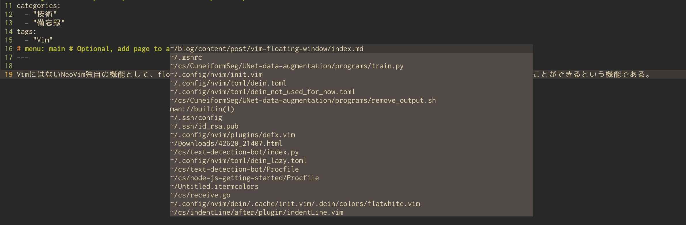

VimにはないNeoVim独自の機能として、floating windowがある。これは、画面内に「浮いている」ウィンドウを作り、そこに何かを表示させることができるという機能である。



一時的に表示したい情報を表示するのに非常に便利であり、この記事では`Denite`における検索ウィンドウと`Deoplete`における補完候補の解説に使う方法を記す。

# Neovim本体の設定

2019/04/06現在のNeovim Stable 0.3.4では、floating windowはついておらず、Neovim development prerelease 0.4.0をインストールする必要がある。[ここ](https://github.com/neovim/neovim/releases/nightly)からインストールしよう。

自分のOSにあったものをインストールし、パスを通せばよい。

# Denite

```init.vim
nnoremap <silent> <space>fr :<C-u>Denite file_mru -split="floating"<CR>
```

のように、`-split="floating"`オプションを付けて実行すればよい。


# Deoplete

Deopleteは`set completeopt+=preview`の状態だとプレビューウィンドウに補完候補の解説を表示する。画面がずれて非常に鬱陶しい。

これは`Deoplete`本体では解決できず、別のプラグインを入れるようヘルプにも書かれている[^shougo-style]。補完候補の解説をpreview windowの代わりにfloating windowで表示してくれるようになるプラグイン[ncm2/float-preview.nvim.git](https://github.com/ncm2/float-preview.nvim)を入れよう。

具体的には、以下のように設定しよう:

```init.vim
set completeopt=menu
" これを０にするか１にするかはお好み
let g:float_preview#docked = 0
```

```dein.toml
[[plugins]]
repo = 'ncm2/float-preview.nvim.git'
```

以上

[^shougo-style]:自分のプラグインの実装は必要最低限に抑え、代わりにその機能をaccessible/highly compatibleにすることで他のプラグイン・個々人の実装を使って容易に拡張可能なものとするというShougoさんの思想の良い例であろう。
