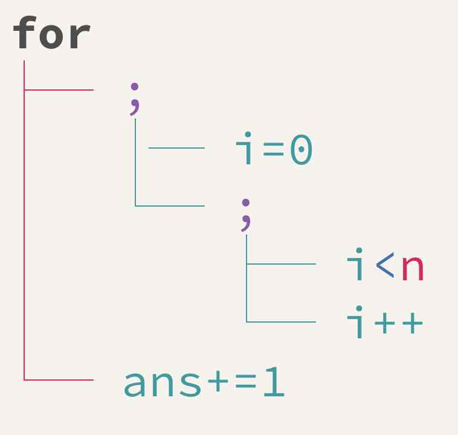

# TL;DR
この間の[自作電卓インタプリタ](/2019/01/%E9%9B%BB%E5%8D%93%E3%82%92%E4%BD%9C%E3%81%A3%E3%81%A6%E3%81%BF%E3%82%88%E3%81%86/)につづけて、自作のコンパイラを作っている。合計1000行くらいのCコード。\
2週間ほど暇を見つけては実装して、こんなCライクなコードが[コンパイルできるようになった](https://github.com/woodyZootopia/woodycc/blob/47aeacb51dc2f7f9dfd46eb4d507fab82676f2d4/test.sh)。アセンブラを吐く。
```C
fib(x){
    if(x==0) return 1;
    if(x==1) return 1;
    return fib(x-1)+fib(x-2);
}
main(){return fib(10);} // this returns 89
```
```C
powerroftwo(x,y){
    while(x!=0){
        y=y*2;
        x=x-1;
    }
    return y;
}
main(){return powerroftwo(5,1);} // this returns 32
```

# 僕も/私もやりたい！というひとへ
自分は現在海外にいるので日本語の本が手に入らなくて辛かったが、本を買える人は買ったほうが学習曲線は速いと思う。\
英語の教科書は~~ネットに転がってたりすることが多く入手しやすいし~~種類が多いので英語が得意な人にはおすすめ。Low Level Programmingとかで調べると幸せになれる気がする。

ネット上にある情報だと、[友人の作ってくれた資料集](https://anqou.net/poc/2019/01/03/post-2650/)が非常に役に立つので、この中から良さそうな資料を見繕ってほしい。\
とくに、Rui Ueyamaさんの[低レイヤを知りたい人のためのCコンパイラ作成入門](https://www.sigbus.info/compilerbook/)は神。これを教科書にしつつ、他のサイトを参考資料に使うと良いと思う。\
上の資料に載っていないものだと、University of Virginiaの出している[x86 Assembly Guide](http://www.cs.virginia.edu/~evans/cs216/guides/x86.html)あたりが命令セットの初心者におすすめ。\

# どうやって作るの？
例によって[友人のスライド](https://speakerdeck.com/anqou/seccamp2018deseruhuhosutockonpairawotukututa)のほうがより高度で面白いが、気にしたら負け。

1. 入力文字列をトークンに分解する
    * `int` `main` `(` `,` `if` `return`とか。要するにスペースを除いていい感じにワードごとに取り出すということ。
        * 逆に言うと、この手順を踏んでいるC言語（および今回作ったやつ）はスペースをどこにいくら入れてもいいので**フリートークン**と呼ばれたりもする。
2. トークン列から意味構造を作る。
    * 木（正確には、関数などのトップレベル要素ごとに木になるので森）になる。
    * 扱いやすいようにしたいので、2分木にして実装するのが無難。
    * 意味構造の木を抽象構文木(Abstract Syntax Tree, AST)という。
    * 例えば、自分は`for(int i=0;i<n;i++) ans+=1;`は以下のように木にするようにしている。ここではとりあえず木構造にできていればなんでもよい。\
    
3. 意味構造を対応する命令に変換し、アセンブリを出力する。
    * 命令セットドキュメントや`gcc -S`の出力を参考にする。

# 感想
* 例によってやるだけ。みんなやろう。
* 再帰関数がうまく機能したときはすごくスッキリするのでみんなやろう。
* 自分で関数を定義できるようになった瞬間やれることがグッと広がって面白くなるのでみんなやろう。
* 非常に少ない命令、スタックを駆使して如何にして複雑なプログラムを書くのかがわかって面白いからみんなやろう。

# 今後の展望
* セルフホストを目指す。\
    * セルフホストとは、「**自分自身をコンパイルできる**」こと。\
    * wdccは**Cで書かれたCコンパイラ**（になる予定）なので、順調に発展していけば「wdccがwdcc自身をコンパイル」することができるっ……！
    * ちなみにたとえば**gccもgccでコンパイルできます**。卵が先か鶏が先かみたいで面白いですね。
* 授業が始まり、研究室でのプログラミングのお仕事も始まったので続きができるのは少しあとになるかも。

(以上です)
